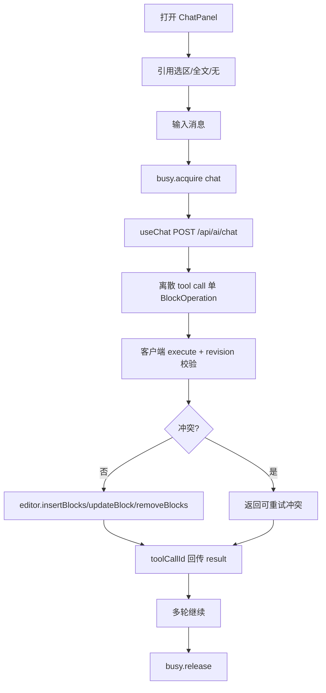

# 功能 PRD：AI 对话助手

## 0. 文档信息

- 功能 ID：FEAT-004
- 所属 Sub：SUB-003 AI 助手
- 所属产品：tap-note
- 总 PRD：`docs/prd/main-prd.md`（v7）
- Sub PRD：`docs/prd/sub-ai-assistant/prd.md`
- 功能目录：`docs/prd/sub-ai-assistant/feat-ai-chat/`
- 文档版本：v1
- 文档状态：草稿
- 类型：混合型（含 UI 组件）

## 1. 功能目标

提供 `@tap-note/ai-chat` 包，实现 Cursor/Copilot Chat 式侧边对话面板，支持引用当前选区/文档作为上下文，通过经验证版本的 AI SDK client-side tools 以离散工具调用修改编辑器文档。多轮对话中每次返回单个 BlockOperation 工具调用，客户端执行后作用于编辑器，聊天气泡展示操作结果。

## 2. 功能边界

### 2.1 本功能包含

- `TapNoteChatPanel` 组件：消息列表、输入框、上下文引用开关（选区/全文/无）、工具调用气泡。
- 基于经验证的 AI SDK React/UI `useChat`，transport 指向 `/api/ai/chat`。
- 服务端持有版本化 `ChatToolSet` schema；客户端只实现同名 tools 的 `execute`（调用 `editor.insertBlocks/updateBlock/removeBlocks`）：`insertBlock` / `updateBlock` / `deleteBlock` / `replaceBlocks` / `moveBlock` / `getDocumentSnapshot`。
- 上下文：选区或全文经 ai-core `DocumentStateBuilder` 序列化为 documentState 随消息发送；体积超限按总 PRD §4.4 分层处理。
- revision 冲突处理与 `toolCallId` 结果回传。

### 2.2 本功能不包含

- 内联状态机、AIMenu/AIToolbarButton、StreamToolExecutor（属 FEAT-003）；
- documentState 构造、transport 工厂、busy state、applier 本体（属 FEAT-002，本 feat 复用）；
- 服务端 streamText/模型路由/JWT/工具 schema 执行（属 FEAT-005，服务端只声明不 execute）；
- `needsApproval` 审批开关（P2 候选，总 PRD §5.2）；
- 批量操作（当前严格单次单操作，总 PRD §17 item 11）。

## 3. 用户角色

- 终端创作者：引用选区/全文或不引用，多轮对话边聊边改，看到每条操作结果气泡。
- 集成开发者：配置 transport、助手与 UI；让两类助手共存且不并发写入。

## 4. 使用场景

```text
创作者打开侧边 TapNoteChatPanel
  -> 选择「引用选区 / 引用全文 / 不引用」
  -> 输入消息（如「把这段改成要点列表」或「加一个小标题」）
  -> busy.acquire("chat")，失败则输入框置灰
  -> useChat(transport=/api/ai/chat) 发送 messages + documentState + documentRevision
  -> server-api 声明版本化 client-side tools（不 execute）返回 UIMessageStream
  -> LLM 返回离散 tool call（每次单个 BlockOperation）
  -> 客户端 tool execute 在浏览器内调用 editor.insertBlocks/updateBlock/removeBlocks
  -> 客户端校验 tool 输入与 documentRevision；冲突不执行返回可重试冲突结果
  -> 执行后以 toolCallId 回传 tool result；聊天气泡展示「已插入块」「已更新块」
  -> 支持多轮；busy.release
```



## 5. 用户故事

- US-009（终端创作者）：点「引用选区」输入「把这段翻译成英文」，AI 调用工具直接替换选区，能看到每条操作结果气泡。
- US-010（终端创作者）：选「引用全文」输入「加一个总结小标题」，AI 调用工具在文档开头插入标题块，文档实时更新。
- US-011（终端创作者）：多轮交流先「列三个要点」再「把第二点展开成段落」，基于上下文连续操作编辑器。
- US-012（集成开发者）：两类助手共存于同一编辑器；同一时刻只运行一个 AI 任务，完成/中止/失败后另一助手立即可用。

## 6. 功能需求

| 需求 ID | 需求描述 | 优先级 | 验收标准 |
|---|---|---|---|
| FR-001 | `TapNoteChatPanel` 含消息列表、输入框、上下文三态开关、工具调用气泡 | P0 | 选区/全文/无三态可切；气泡展示操作类型与结果 |
| FR-002 | 基于 AI SDK `useChat`，transport 指向 `/api/ai/chat` | P0 | 多轮消息正确发送与渲染流式 text/tool part |
| FR-003 | 客户端 tools `execute` 实现 insert/update/delete/replace/move/getDocumentSnapshot | P0 | 同名 tools 与服务端 schema 对齐；execute 调用 editor API |
| FR-004 | 离散 tool call，单次单操作 | P0 | 每次 tool call 对应一个 BlockOperation；聊天气泡逐条展示 |
| FR-005 | 上下文三态引用，经 ai-core 序列化为 documentState | P0 | 选区超 4K 前端拦截；全文按 8K/2× 分层；不引用不发 documentState 不暴露 getDocumentSnapshot |
| FR-006 | 每个 tool 携带 `baseDocumentRevision` 与块前置条件 | P0 | revision/前置条件冲突不执行，返回可重试冲突结果 |
| FR-007 | 执行后以 `toolCallId` 回传 tool result 进入后续消息 | P0 | 多轮可基于前次结果继续 |
| FR-008 | 触发前查询会话 busy，进行中则输入框置灰 | P0 | 另一 AI 进行中时 chat 输入框置灰；完成/中止/失败后恢复 |
| FR-009 | `getDocumentSnapshot` 仅「引用全文」+允许按需读取时暴露，受块数/token 预算约束 | P0 | 不引用模式不暴露；超额受限 |
| FR-010 | 默认 zh-CN 字典，可替换 | P0 | 文案中文，可覆盖 |
| FR-011 | 发布包授权干净 | P0 | `dependencies` 不含 `@blocknote/xl-ai` |

## 7. 业务规则

- 工具执行规则（总 PRD §9）：对话服务端持有版本化工具 schema，客户端只执行同名 tools 并回传结果，服务端不 execute。前期直接执行，不设审批开关；`needsApproval` 列入 P2 候选。
- 写入粒度（总 PRD §9）：离散 tool call，单次单操作（每次工具调用对应一个 BlockOperation），在聊天里逐条展示，区别于内联的流式数组。每个操作带 `baseDocumentRevision` 与目标块前置条件；校验失败时不执行并返回可重试冲突结果。
- 上下文规则（总 PRD §9）：支持「引用选区 / 引用全文 / 不引用」三态；引用内容经 ai-core 序列化为带 `schemaVersion` 和 `documentRevision` 的 documentState；不引用不发文档内容，也不暴露读取文档工具。
- 上下文体积分层（总 PRD §9）：选区软上限 4K，超限前端拦截提示；全文预算 8K，超预算截断带 `[文档已截断：共 N 块，此处含前 M 块]`，>2× 改发结构化大纲。
- 并发规则（总 PRD §9）：触发前查询 busy；进行中则输入框置灰；不同编辑器会话互不阻塞。
- 授权规则（总 PRD §9）：`dependencies` 不含 `@blocknote/xl-ai`。

## 8. 数据输入与输出

- 输入：`transport`、`documentStateBuilder`、`model`、`editor` 实例、可选字典。
- chat 请求体：`{ messages, documentState?, documentRevision?, model }`。
- 工具：`insertBlock`/`updateBlock`/`deleteBlock`/`replaceBlocks`/`moveBlock`/`getDocumentSnapshot`，每个携带 `baseDocumentRevision` 与目标块 ID/前置条件。
- 输出：UIMessage 流（text part + tool part 状态），工具结果气泡，editor 文档实时变化。

## 9. 与其他功能的关系

| 功能 | 关系 |
|---|---|
| FEAT-001 editor | 调用 editor.insertBlocks/updateBlock/removeBlocks |
| FEAT-002 ai-core | 复用 schema/DocumentStateBuilder/busy/transport/上下文预算 |
| FEAT-003 ai-inline | 共享 busy；进行中则 chat 输入框置灰 |
| FEAT-005 ai-backend | 消费 `/api/ai/chat`（服务端声明 client-side tools 不 execute）与 `/api/ai/models` |
| FEAT-006 reference-app | `/chat`、`/both` 路由装载 |

## 10. 异常和边界场景

- 选区超 4K tokens：前端拦截，提示减少选区或改用「引用全文+指令」，不发请求。
- 全文超预算：截断带标记；>2× 改发大纲。
- 不引用模式：不发 documentState，不暴露 `getDocumentSnapshot`。
- revision/前置条件冲突：不执行，向模型和用户返回可重试冲突结果（气泡展示）。
- 工具 execute 失败：气泡展示失败，可重试或继续多轮。
- 另一 AI busy：输入框置灰并说明原因。
- `getDocumentSnapshot` 超预算：受限返回，不无限读取。
- 多轮上下文过长：由 FEAT-005 服务端限制消息数/token/工具轮数。

## 11. 功能验收标准

1. 选「引用选区」发消息，AI 收到的 documentState 含选区内容；选「引用全文」预算内发完整快照，超预算发符合 §4.4 的截断快照或大纲；选「不引用」请求不含 documentState 且模型不可调用读取文档工具；日志仅验证元数据不记录正文（§16 item 6）。
2. AI 每次工具调用对应单个 BlockOperation，气泡展示「已插入/已更新/已删除块」，编辑器文档实时变化，支持多轮（§16 item 7）。
3. 内联进行中时 chat 输入框置灰不可发送；反之亦然；一者完成/中止/拒绝后另一者立即可用（§16 item 8）。
4. 选区超 4K 前端拦截提示（不发请求）；引用全文 ≤8K 发完整，超预算发含 `[文档已截断]` 且 ≤ 预算，>2× 改发结构化大纲（§16 item 9）。
5. 工具携带过期 `documentRevision` 或不满足块前置条件时不执行，气泡展示可重试冲突结果（§16 item 10）。
6. `bun run typecheck`、`bun run lint`、契约测试（tool schema）、组件行为测试全绿。
7. 发布包 `dependencies` 不含 `@blocknote/xl-ai` 或 GPL/AGPL。

## 12. 待确认事项

- 【总 PRD §17 item 5 / v11 部分决策】AI SDK **v7** 锁定（见总 PRD §14 v11 决策）。v6→v7 breaking changes 已记录（`needsApproval`→`toolApproval`、`UIMessage.content`→`parts`、`DefaultChatTransport` 封装对象）。**仍待 FEAT-004 实施前以 Context7 + 最小示例验证**：v7 client-side tools `execute`/tool result 回传精确 API、`useChat` + `DefaultChatTransport` 形状、`@ai-sdk/alibaba@2`/`@ai-sdk/google@4` 与 `ai@7` 的 peerDep 兼容性。
- 【总 PRD §17 item 11】client-side tools 是否需要支持「批量操作」，还是严格单次单操作（当前假设严格单操作，多操作走多轮或多 tool call）。
- 【总 PRD §17 item 13】token 估算算法待确认（影响上下文预算）。
- 【总 PRD §5.2】`needsApproval` 审批开关为 P2 候选，当前不实现，UI 不应暗示存在该开关。

## 13. 变更记录

| 版本 | 日期 | 变更内容 |
|---|---|---|
| v1 | 2026-07-17 | 基于总 PRD v7 与 SUB-003 文档创建。 |
