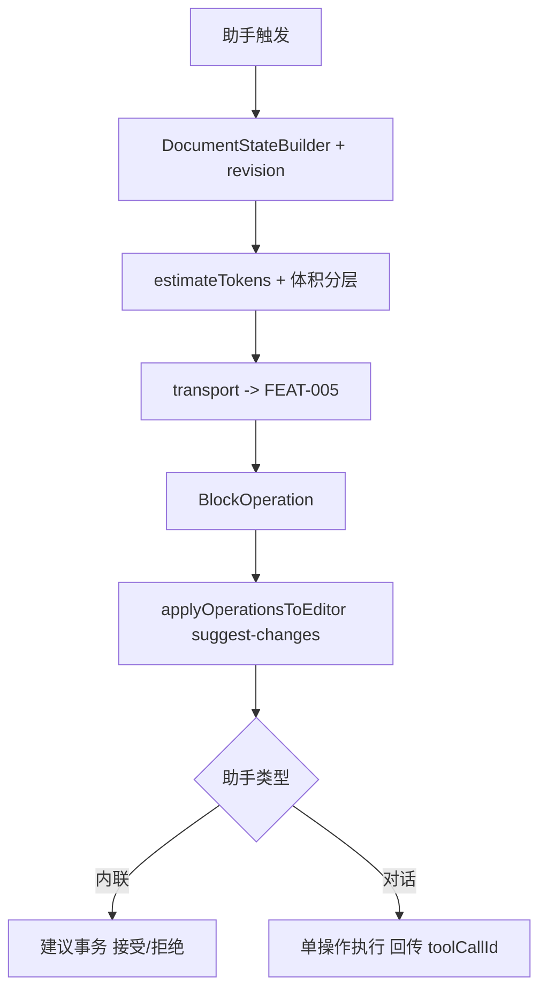

# 功能 PRD：AI 共享核心

## 0. 文档信息

- 功能 ID：FEAT-002
- 所属 Sub：SUB-003 AI 助手
- 所属产品：tap-note
- 总 PRD：`docs/prd/main-prd.md`（v7）
- Sub PRD：`docs/prd/sub-ai-assistant/prd.md`
- 功能目录：`docs/prd/sub-ai-assistant/feat-ai-core/`
- 文档版本：v1
- 文档状态：草稿
- 类型：纯后端库（不生成 `ui.md`）

## 1. 功能目标

提供 `@tap-note/ai-core` 包，集中两类助手共享的协议、schema、执行器与 transport 工厂，避免内联与对话包重复实现，保证两者写入文档的语义一致。FEAT-003 内联助手与 FEAT-004 对话助手都通过 ai-core 序列化文档状态、定义 BlockOperation、并把操作应用到编辑器；集成开发者也可直接用 ai-core 自定义助手。

## 2. 功能边界

### 2.1 本功能包含

- `BlockOperation` Zod schema + 类型：`insertBlock | updateBlock | deleteBlock | replaceBlocks | moveBlock`。
- `DocumentStateBuilder`：把编辑器受影响块（含选区）序列化为 `{ format: "blocks-json", schemaVersion, documentRevision, blocks, selection? }`。
- `injectDocumentStateMessages(messages, documentState)`：把文档状态注入 AI 消息。
- `applyOperationsToEditor(editor, operations)`：经 `@handlewithcare/prosemirror-suggest-changes` 实现可回退应用（`suggestChanges`/`applySuggestions`/`revertSuggestions`）。
- `createServerTransport({ baseUrl, model })` / `createProxyTransport(...)`：transport 工厂。
- `createAIBusyState()`：编辑器会话级 AI 互斥状态。
- `estimateTokens(text)` / 上下文体积分层处理（选区软上限、全文截断/大纲）。
- zh-CN 字典基础、共享类型。

### 2.2 本功能不包含

- 内联状态机、AIMenu/AIToolbarButton UI（属 FEAT-003）；
- 聊天面板 UI、`useChat` 集成（属 FEAT-004）；
- 服务端 streamText/模型路由/JWT（属 FEAT-005）；
- 编辑器内核 UI（属 FEAT-001）。

## 3. 用户角色

- 集成开发者：直接用 ai-core 自定义助手，配置 transport 与上下文策略。
- 终端创作者：间接享受两类助手一致的写入语义。

## 4. 使用场景

```text
助手触发（内联或对话）
  -> DocumentStateBuilder 序列化受影响块/选区为 documentState（带 schemaVersion + documentRevision）
  -> 估算 token，按上下文体积分层策略处理
  -> transport 经 FEAT-005 streamText 发送
  -> 收到 BlockOperation（内联流式 / 对话离散）
  -> applyOperationsToEditor 经 suggest-changes 应用（可回退）
  -> 内联：建议事务后接受/拒绝；对话：单操作执行后回传 toolCallId
```



## 5. 用户故事

- 集成开发者：我希望两类助手共享同一套 documentState/BlockOperation 协议，避免重复实现且写入语义一致。
- 集成开发者：我希望 transport 工厂能一行接入服务端 streamText。
- 集成开发者：我希望上下文超限时前端拦截，不静默截断用户显式选择的选区。

## 6. 功能需求

| 需求 ID | 需求描述 | 优先级 | 验收标准 |
|---|---|---|---|
| FR-001 | `BlockOperation` Zod schema + 类型覆盖 insert/update/delete/replace/move | P0 | 服务端与客户端共享同一 schema；`.parse()` 校验非法操作 |
| FR-002 | `DocumentStateBuilder` 输出 `{format:"blocks-json",schemaVersion,documentRevision,blocks,selection?}` | P0 | 受影响块与选区正确序列化；revision 单调 |
| FR-003 | `injectDocumentStateMessages` 把 documentState 注入 AI 消息 | P0 | 注入后消息可被 FEAT-005 streamText 消费 |
| FR-004 | `applyOperationsToEditor` 经 suggest-changes 可回退应用 | P0 | 应用后可接受/拒绝/回退；拒绝只回退所属事务 |
| FR-005 | `createServerTransport({baseUrl,model})` 与 `createProxyTransport` | P0 | transport 携带 model；不持有 LLM Key |
| FR-006 | `createAIBusyState()` 会话级互斥状态 | P0 | 任一 AI 进行中时另一助手入口禁用；完成/中止/失败/卸载释放 |
| FR-007 | `estimateTokens` 与上下文体积分层（选区 4K 软上限、全文 8K 预算、2× 改大纲） | P0 | 选区超限前端拦截提示；全文按预算完整/截断/大纲；不引用不发 documentState |
| FR-008 | 默认 zh-CN 字典基础 | P0 | 字典可由助手包覆盖 |
| FR-009 | 所有输入 Zod `.parse()` 校验 | P0 | 非法输入抛 ZodError 不静默 |
| FR-010 | 发布包授权干净 | P0 | `dependencies` 不含 `@blocknote/xl-ai` 或 GPL/AGPL |

## 7. 业务规则

- 操作一致性（总 PRD §9）：每个 AI 任务绑定起始 `documentRevision` 与建议 transaction；BlockOperation 必须携带目标块 ID 与前置条件。内联拒绝只回退该 AI transaction，不覆盖用户后续编辑；对话操作遇到 revision 或前置条件冲突时不执行，返回可重试冲突结果。
- 上下文体积分层（总 PRD §9）：选区软上限默认 4K tokens（可配），超限前端拦截提示减少选区或改用「引用全文+指令」，不静默截断；引用全文预算默认 8K，超预算截断带 `[文档已截断：共 N 块，此处含前 M 块]`，>2× 预算改发结构化大纲（标题块+首段摘要）。
- 不引用模式不发送 documentState，也不暴露读取文档的工具。
- 并发规则（总 PRD §9）：每个编辑器会话创建一个共享 busy 状态并注入内联与对话助手；不同编辑器会话互不阻塞。
- 授权规则（总 PRD §9）：`dependencies` 不含 `@blocknote/xl-ai`；仅阅读 `resource/BlockNote` submodule 作思路参考。

## 8. 数据输入与输出

- `DocumentState`：`{ format: "blocks-json", schemaVersion, documentRevision, blocks: PartialBlock[], selection?: { start, end } }`。
- `BlockOperation`：`{ type: "insertBlock"|"updateBlock"|"deleteBlock"|"replaceBlocks"|"moveBlock", baseDocumentRevision, targetBlockId?, ... }`。
- transport 输出：指向 `/api/ai/editor/streamText` 或 `/api/ai/chat` 的请求；不持有 Key。
- busy state 输出：`{ status: "idle"|"in-progress", type?: "inline"|"chat" }` 与 `acquire()`/`release()`。

## 9. 与其他功能的关系

| 功能 | 关系 |
|---|---|
| FEAT-001 editor | 消费 editor 实例执行 blocks 操作；ai-core 不依赖编辑器 UI |
| FEAT-003 ai-inline | 复用 schema/DocumentStateBuilder/applier/busy/transport；内联不复用 chat executor |
| FEAT-004 ai-chat | 复用 schema/DocumentStateBuilder/busy/transport；对话不复用 inline StreamToolExecutor |
| FEAT-005 ai-backend | 服务端工具 schema 与本 feat BlockOperation 对齐；transport 指向其端点 |

## 10. 异常和边界场景

- documentState 体积超预算：按分层策略处理（截断/大纲）；选区超软上限拦截。
- BlockOperation revision 过期或前置条件冲突：不执行，返回可重试冲突结果（对话）/ 回退（内联）。
- 流中断：中止并回退所属事务，不污染历史。
- 助手实例与编辑器版本不匹配：调用方负责版本一致；ai-core 仅提供契约。
- `getDocumentSnapshot`（对话按需读取）：仅在用户选「引用全文」且允许按需读取时暴露，受块数与 token 预算约束。

## 11. 功能验收标准

1. `BlockOperation` schema 覆盖 insert/update/delete/replace/move，服务端与客户端共享（总 PRD §16 item 10）。
2. documentState 正确携带 `schemaVersion` 与 `documentRevision`。
3. `applyOperationsToEditor` 经 suggest-changes 可回退；拒绝只回退所属事务，不覆盖用户后续编辑（§16 item 10）。
4. 选区超 4K tokens 前端拦截提示（不发请求）；引用全文 ≤8K 发完整快照，超预算发含 `[文档已截断]` 标记且 ≤ 预算，>2× 改发结构化大纲（§16 item 9）。
5. 不引用模式请求不含 documentState，不暴露读取文档工具（§16 item 6）。
6. 会话级 busy：任一 AI 进行中时另一助手入口禁用；完成/中止/失败后另一助手立即可用（§16 item 8）。
7. `bun run typecheck`、`bun run lint`、schema/预算/去重/busy/revision 单元测试全绿。
8. 发布包 `dependencies` 不含 `@blocknote/xl-ai` 或 GPL/AGPL。

## 12. 待确认事项

- 【总 PRD §17 item 13】token 估算算法：近似字符数/4 vs 精确 tiktoken。当前以近似算法为方案草稿，实施前确认。
- 【总 PRD §17 item 11】对话 client-side tools 是否支持批量操作（当前假设严格单操作，多操作走多轮或多 tool call）。
- 【总 PRD §17 item 5】AI SDK 精确版本与 transport/partial tool call API 须实施前以 Context7 + 最小示例锁定。
- 【AI 推断】`@handlewithcare/prosemirror-suggest-changes` 与 BlockNote 0.51.4 的兼容性须最小端到端验证。

## 13. 变更记录

| 版本 | 日期 | 变更内容 |
|---|---|---|
| v1 | 2026-07-17 | 基于总 PRD v7 与 SUB-003 文档创建。 |
