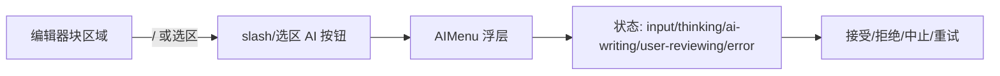

# UI 方案：AI 内联助手

## 0. 文档信息

- 功能 ID：FEAT-003；所属 Sub：SUB-003；状态：草稿；类型：混合型；依据：SUB-003 `ui.md`。

## 1. 信息架构与入口

内联入口包括：slash `/ai` 菜单项、选区 AI 工具栏按钮、AIMenu 浮层。入口在编辑器块区域上下文浮现，非固定面板。

```text
创作者在空块输入 / 或选中文本
  -> slash 菜单出现 /ai 项（或选区浮现 AI 按钮）
  -> 选择 /ai 或点按钮 -> AIMenu 浮层
  -> 输入指令 -> 状态流转可见
```



## 2. 通用交互与视觉

- 状态可见性：inline 依次可见 `user-input`（输入框）、`thinking`（思考指示）、`ai-writing`（逐块流式建议，可见实时变化）、`user-reviewing`（接受/拒绝控制）、`error`（错误 + 重试）。
- `user-reviewing` 必须提供接受、拒绝按钮与快捷键（如 `Enter` 接受、`Esc` 拒绝）。
- 接受/拒绝控制不得被其他浮层遮挡。
- busy 时另一入口（slash 项/按钮）禁用并文字说明原因；不因一个编辑器会话阻止其他会话（SUB-003 ui.md §2）。
- 复用 `@workspace/ui` 控件；操作类型以文字 + 图标表达，不能仅以颜色区分。
- 建议状态以 suggest-changes 的高亮/标注呈现，非破坏性可见。

## 3. 字段、操作、校验与反馈

- AIMenu 输入框：指令文本；`Enter` 发送（Shift+Enter 换行）。
- 接受：`applySuggestions`，合并到正式文档，焦点回到编辑位置。
- 拒绝：`revertSuggestions`，回退到写作前状态，焦点回到触发块。
- 中止：写作中显示中止按钮，立即停止并回退。
- 重试：error 态显示「重试」按钮，回到 thinking，保留原指令。
- 校验：指令空则发送禁用；`streamToolsProvider` 与服务端 schema 不匹配时提示。

## 4. 加载、空状态、错误状态与权限状态

- 加载/思考：流式首块出现前显示思考指示（如脉冲点），不阻塞 UI。
- 空状态：AIMenu 输入框为空时发送禁用。
- 错误：error 态显示可理解错误 + 重试；不暴露服务端堆栈/内部路径。
- 权限/busty：认证失败提示重新认证；另一 AI busy 时入口置灰并说明原因。

## 5. 国际化、可访问性与响应式

- 默认 zh-CN，状态文案/错误可由字典替换。
- AIMenu 支持焦点陷阱、`Escape` 关闭、发送/接受/拒绝后焦点回到合理编辑位置。
- 流状态以 `aria-live` 播报（如「AI 正在写作」/「写作完成，等待审阅」）。
- 窄屏：AIMenu 浮层贴合触发块，不遮挡接受/拒绝控制。

## 6. UI 验收标准

- 用户能通过键盘完成 `/ai` 唤起、输入、发送、中止、接受、拒绝（§16 item 8 可访问性）。
- 逐块流式可见（§16 item 2）；接受保留、拒绝回退（§16 item 3）。
- 失败可重试（§16 item 5）。
- busy 时另一入口禁用并文字说明（§16 item 8）。
- AI 流式期间人工修改同一块后，拒绝不得覆盖（§16 item 10）。
- 现代桌面浏览器与窄屏不遮挡接受/拒绝控制。

## 7. 交互参考

| 来源 | 日期 | 借鉴 | 限制 |
|---|---|---|---|
| BlockNote `xl-ai` | 2026-07-17 | AIMenu/AIToolbarButton/Slash 项交互范式 | GPL；仅体验参考，不复制代码 |
| Notion AI | 2026-07-17 | 逐块流式、接受/拒绝、`/ai` 唤起 | 闭源，仅体验对标 |
| AI SDK 官方 UI 文档 | 2026-07-17 | 工具流状态与结果呈现 | API 版本待锁定 |

## 8. 待确认事项

- `needsApproval` 审批开关为 P2 候选，当前 UI 不应暗示存在该开关（SUB-003 ui.md §6）。
- AI SDK React/UI 包版本与流状态 UI API 须实施前锁定（总 PRD §17 item 5）。
