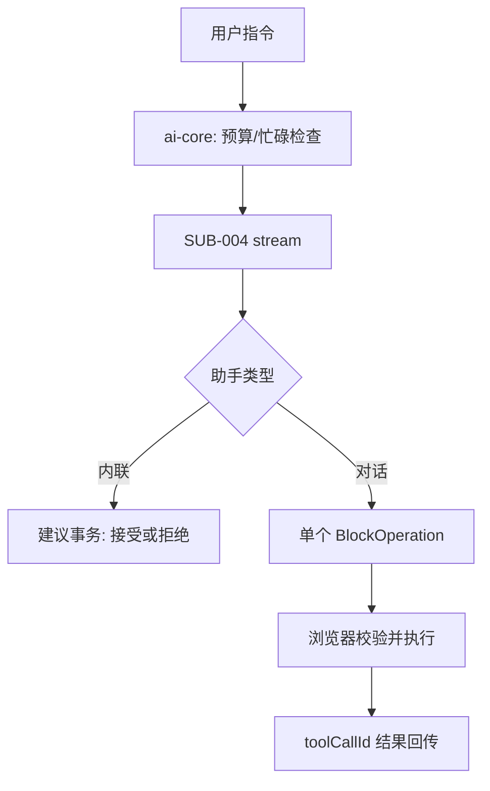

# 需求分支 PRD：AI 助手

## 0. 文档信息

- Sub ID：SUB-003；所属产品：tap-note；总 PRD：`docs/prd/main-prd.md`；目录：`docs/prd/sub-ai-assistant/`；版本：v1；状态：草稿。

## 1. 分支目标

提供授权干净的共享 AI 文档操作协议、Notion 式内联写作和 Cursor/Copilot 式侧边对话。两类助手共享上下文、文档操作与会话级互斥能力，但采用不同写入体验。

## 2. 分支边界

### 2.1 本分支包含

`@tap-note/ai-core`、`@tap-note/ai-inline`、`@tap-note/ai-chat`，包括 documentState、BlockOperation、上下文预算、客户端执行、接受/拒绝和聊天气泡。

### 2.2 本分支不包含

模型凭据、JWT 验证、模型路由和服务端执行编辑器操作；编辑器 UI 内核、持久化和导出。

### 2.3 与其他 Sub 的边界与协作

SUB-002 提供编辑器实例和 demo 挂载点；SUB-004 持有 API、模型、认证和版本化工具 schema；SUB-006 发布 SDK/API 文档。助手只提交受校验请求，并在浏览器本地应用允许的操作。

## 3. 用户角色

终端创作者通过指令写作或多轮对话修改文档；集成开发者配置 transport、助手与 UI；自托管者从服务端观察匿名化调用元数据。

## 4. 核心业务流程

```text
创作者选择内联或对话入口
  -> ai-core 建立 documentState + documentRevision
  -> 检查会话 busy 和上下文预算
  -> 请求 SUB-004 流式 API
  -> 解析并校验 BlockOperation
  -> 内联：建议事务后接受/拒绝
  -> 对话：单操作工具调用、本地执行并回传 toolCallId 结果
```



## 5. 包含的功能模块

| 功能 ID | 功能名称 | 目录 | 优先级 | 说明 |
|---|---|---|---|---|
| FEAT-002 | AI 共享核心 | `feat-ai-core` | P0 | 协议、上下文、applier、busy state。 |
| FEAT-003 | AI 内联助手 | `feat-ai-inline` | P0 | 流式建议与接受/拒绝。 |
| FEAT-004 | AI 对话助手 | `feat-ai-chat` | P0 | 多轮侧边对话与本地工具执行。 |

## 6. 用户故事

- 用户可 `/ai` 续写或改写并接受、拒绝、中止或重试。
- 用户可引用选区、全文或不引用进行多轮聊天，并看到每个操作结果。
- 集成开发者可让两类助手共存且不发生同一会话并发写入。

## 7. 分支级业务规则

- 内联使用单轮流式 operations；对话每次 tool call 仅对应一个 BlockOperation。
- 选区超 4K token 阻止发送；全文按 8K/2 倍预算采用完整、截断或大纲策略。
- 不引用时不发送文档且不暴露快照读取工具。
- 操作必须带 revision、目标块和前置条件；冲突不执行。拒绝只回滚所属 AI 事务，不覆盖用户后续编辑。

## 8. 分支级数据与接口约定

`DocumentState` 至少含 `format`、`schemaVersion`、`documentRevision`、`blocks` 和可选 `selection`；`BlockOperation` 仅允许 insert/update/delete/replace/move。服务端工具 schema 是 SUB-004 所有，客户端执行同名已验证工具并以 `toolCallId` 回传。

## 9. 依赖与前置条件

依赖 FEAT-001 编辑器和 FEAT-005 API。总 PRD 禁止 `@blocknote/xl-ai`；当前三个包均未创建。

## 10. 分支验收标准

- 内联逐块可见、可接受/拒绝且不破坏人工修改。
- 对话三态上下文、单操作气泡、多轮回传和冲突提示正确。
- 同一编辑器仅一个 AI 任务；不同编辑器会话独立。
- 所有操作、输入和流错误有 Zod 校验与用户可理解反馈。

## 11. 待确认事项

- 【总 PRD 待确认】token 估算采用字符近似还是精确 tokenizer。
- 【总 PRD 待确认】严格单操作是否在后续支持批量操作。

## 12. 变更记录

| 版本 | 日期 | 变更内容 |
|---|---|---|
| v1 | 2026-07-17 | 基于总 PRD v7 创建。 |
