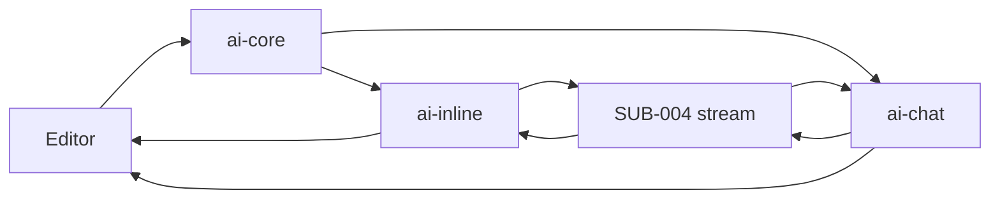

# 技术方案：AI 助手

## 0. 文档信息

- Sub ID：SUB-003；状态：草稿；依据：总 PRD v7、当前代码库与 2026-07-17 调研。

## 1. 当前项目事实

`packages/tap-note-ai-core`、`tap-note-ai-inline`、`tap-note-ai-chat` 尚不存在。`apps/server-api` 已有 AI SDK provider/approval 脚手架，但其路由只实现审批示例，不是目标编辑器协议。

## 2. 架构、领域与数据流

ai-core 定义 Zod 的 document/operation 契约、预算器、transport、suggestion applier 和每会话 busy state；inline 管理 suggestion transaction；chat 管理 UIMessage 和浏览器端单操作执行。服务端永远不接收客户端定义的工具 schema。

```text
editor -> ai-core(DocumentState, revision) -> transport -> SUB-004
  ^                                                    |
  +-- inline suggestion / chat local executor <--------+
```



## 3. 接口、状态与集成

- `DocumentStateBuilder` 序列化当前块/选择，附 schema/revision；所有输入以 Zod parse 校验。
- inline 状态为 user-input、thinking、ai-writing、user-reviewing、error；使用可回退 transaction。
- chat 基于 UIMessage 流呈现 text 与 tool part 状态；执行前复核 revision 和块前置条件，结果与 `toolCallId` 关联。
- 与 SUB-004 同步 HTTP 流集成；不共享数据库或服务端内部类型。

## 4. 安全、测试与发布

- 限制可执行 operation、块目标、预算和上下文模式，拒绝无效/过期输入；不记录正文到默认日志。
- 单元测试覆盖 schema、预算、去重、busy 和 revision；契约测试覆盖 UIMessage/tool schema；集成测试覆盖 stream、accept/revert、工具回传与冲突；FEAT 测试细化组件行为。
- 三包独立发布，依赖闭包和 tarball 扫描不得含 GPL/专有 XL 代码；故障可通过禁用助手或回滚各包，不回滚用户文档。

## 5. 调研、依赖与决策

| 来源 | 日期 | 可借鉴/结论 | 限制 |
|---|---|---|---|
| Context7 `/websites/ai-sdk_dev` | 2026-07-17 | `streamText` 可产生 UIMessage stream；`DefaultChatTransport`/`useChat` 和工具状态适合 chat UI；Hono 示例可返回 UI stream。 | 具体 AI SDK 版本/API 须实施前锁定。 |
| BlockNote 官方仓库 | 2026-07-17 | core 可作为编辑器依赖。 | `xl-ai` 是 GPL/商业授权，排除。 |
| `@handlewithcare/prosemirror-suggest-changes`（总 PRD 调研） | 2026-07-17 | 可作为自有 accept/revert 机制候选。 | 实施前再核对版本、许可证和 BlockNote 兼容性。 |

备选：复用 xl-ai 可缩短开发，但违反授权目标；单一助手包会混淆不同状态机。采用三包加共享 core。

## 6. 风险与待确认

- partial tool call 的精确 API 和 AI SDK 版本未锁定。
- suggest-changes 与 BlockNote 版本的交互、流中人工编辑冲突需要最小端到端验证。
- P2 审批开关不属于当前实现，不能被提前作为默认行为。
