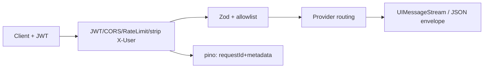

# 功能 PRD：AI 后端服务

## 0. 文档信息

- 功能 ID：FEAT-005
- 所属 Sub：SUB-004 AI 服务平台
- 所属产品：tap-note
- 总 PRD：`docs/prd/main-prd.md`（v7）
- Sub PRD：`docs/prd/sub-ai-platform/prd.md`
- 功能目录：`docs/prd/sub-ai-platform/feat-ai-backend/`
- 文档版本：v1
- 文档状态：草稿
- 类型：纯后端（不生成 `ui.md`）

## 1. 功能目标

基于 Hono + 经验证 AI SDK 的可自托管 AI 网关 `apps/server-api`，提供内联写作 streamText、对话 chat、模型列表、可选透明代理，并保留现有审批代理作为独立示例。Key 不外泄，多模型可切换，生产端点校验集成方 BFF/外部身份提供方签发的短期 JWT。

## 2. 功能边界

### 2.1 本功能包含

- `POST /api/ai/editor/streamText`：内联流式写作。
- `POST /api/ai/chat`：对话流式，服务端声明 client-side tools 不 execute。
- `GET /api/ai/models`：返回 allowlist 模型元数据。
- `POST /api/ai/proxy`（可选）：透明代理。
- `POST /api/ai/agents/approval`：保留现有审批代理作独立示例。
- Provider、JWT、CORS、限流、requestId、pino 日志、统一错误处理、`config/env.ts` fail-fast。

### 2.2 本功能不包含

- 编辑器 UI、客户端 operation 执行、documentState 构造（属 FEAT-002/003/004）；
- 终端用户账号签发与长期 Token 分发（总 PRD §5.2 明确排除）；
- 持久化、导出、字体（属其他 Sub）。

## 3. 用户角色

- 自托管运维者：配置 provider/JWT/CORS 环境变量即可启动；观察匿名化日志。
- 集成开发者：调用公开 API 与 OpenAPI 契约。
- 终端创作者：通过宿主应用间接使用服务，不直接消费 API。

## 4. 使用场景

```text
客户端携带短期 JWT 请求 /api/ai/*
  -> 网关清理伪造 X-User-* 头并验证 JWT/限流
  -> Zod 校验 body、documentState、model allowlist
  -> 内联：注入 documentState，streamText 带服务端 streamTool schema，返回 UIMessageStream
  -> 对话：UIMessage 转模型消息，注入 documentState，声明版本化 client-side tools 不 execute，返回 UIMessageStream
  -> 模型：GET 返回 allowlist 元数据
  -> 记录 requestId、主体、模型、用量、状态（不记录正文）
```



## 5. 用户故事

- US-006（自托管运维者）：配置 `DASHSCOPE_API_KEY` 与 JWT 验证配置即可启动；浏览器永远拿不到 API Key。
- US-007（自托管运维者）：日志带 requestId，可排查某次 AI 调用全链路。
- US-005（终端创作者）：下拉切换模型，切换后下一次调用使用新模型，前端无 Key 暴露。

## 6. 功能需求

| 需求 ID | 需求描述 | 优先级 | 验收标准 |
|---|---|---|---|
| FR-001 | `POST /api/ai/editor/streamText` 接收 `{messages, documentState, model}`，Zod 校验，注入 documentState，`streamText` 带服务端 streamTool schema，返回 UIMessageStream | P0 | 合法请求返回流式 UIMessage；非法 body/model 被拒；客户端不得提交或覆盖工具定义 |
| FR-002 | `POST /api/ai/chat` 接收 `{messages, documentState?, documentRevision?, model}`，UIMessage 转模型消息，声明版本化 client-side tools 不 execute，返回 UIMessageStream | P0 | 工具结果以 `toolCallId` 回传进入后续消息；服务端不 execute 编辑器操作 |
| FR-003 | `GET /api/ai/models` 返回 `{models:[{id,label,provider,capabilities}]}`，仅返回已配置且 allowlist 中的模型 | P0 | 未列出 modelId 被拒绝且不回退默认模型；默认 JWT 保护，显式开启才可公开且只返回元数据 |
| FR-004 | 生产 `/api/ai/*` 校验短期 JWT 的签名算法、issuer、audience、exp、sub 与最小权限声明 | P0 | 网关清理客户端 `X-User-*` 头；浏览器无长期共享 Token；健康检查可匿名 |
| FR-005 | CORS 受 `CORS_ORIGIN` 控制；requestId 中间件；pino 结构化日志记录主体、模型、用量、耗时、状态 | P0 | 不记录 prompt/文档正文/工具结果；同一 requestId 串联全链路 |
| FR-006 | 限流：每认证主体限制速率、并发、消息数、输入/输出 token、工具调用轮数、流持续时间 | P0 | 超限返回稳定错误码并脱敏 |
| FR-007 | `config/env.ts` 用 Zod 校验环境变量，`safeParse` 失败 `process.exit(1)`；业务代码不直接读 `process.env` | P0 | 启动时 fail-fast；`.env.example` 文档化 |
| FR-008 | 修复 `defaultAgentModel` 导出缺失；补 `apps/server-api/package.json` 与 `index.ts` | P0 | 现有 approval 脚手架可独立运行 |
| FR-009 | 统一错误处理：`AppError`/`ZodError`(422)/未知(500 + INTERNAL_ERROR) | P0 | 对外响应脱敏，不泄漏堆栈/内部路径 |
| FR-010 | 保留 `POST /api/ai/agents/approval` 为独立示例，不进内联/对话主流程 | P0 | 路由可访问但不被主流程引用 |
| FR-011 | 非流式响应统一 `{code,message,data}`，成功 `code="SUCCESS"`；流式端点直接返回 UIMessageStream | P0 | 流端点不套业务信封 |
| FR-012 | `POST /api/ai/proxy`（可选）按 provider 注入 Key | P1 | 透明代理可独立启用 |

## 7. 业务规则

- 模型 ID 形如 `<provider>:<model>`；服务端仅返回已配置且 allowlist 中的模型，拒绝未列出的 modelId，不得回退默认（总 PRD §9）。
- 工具执行规则：editor 端点服务端持有 streamTool schema；chat 端点服务端声明版本化 client-side tools 不 execute，客户端执行并按 `toolCallId` 回传（总 PRD §9）。
- 安全规则：生产 `/api/ai/*` 校验短期 JWT；`GET /api/ai/models` 默认受 JWT 保护；健康检查可匿名；网关清理客户端身份头（总 PRD §9）。
- 成本与滥用控制：限流 + 隐私日志（总 PRD §9）。
- API 契约：业务路由以 `/api/` 前缀；非流式统一信封；流式不套信封（总 PRD §9）。

## 8. 数据输入与输出

- editor streamText 入参：`{ messages, documentState, model }` → 出参：UIMessageStream。
- chat 入参：`{ messages, documentState?, documentRevision?, model }` → 出参：UIMessageStream。
- models 出参：`{ models: [{ id, label, provider, capabilities }] }`。
- 非流式错误：`{ code: string, message: string, data: unknown }`，成功 `code="SUCCESS"`。

## 9. 与其他功能的关系

| 功能 | 关系 |
|---|---|
| FEAT-002 ai-core | 持有与服务端对齐的 documentState/BlockOperation 契约；服务端工具 schema 版本与客户端同名工具对齐 |
| FEAT-003 ai-inline | 消费 `/api/ai/editor/streamText` 与 `/api/ai/models` |
| FEAT-004 ai-chat | 消费 `/api/ai/chat` 与 `/api/ai/models` |
| FEAT-006 reference-app | demo 经 Vite proxy `/api → localhost:3000` 连接本服务 |
| FEAT-007 developer-sdk | 发布 OpenAPI 契约与部署文档 |

## 10. 异常和边界场景

- JWT 缺失/过期/签名错误：401，`AUTH_INVALID` 错误码，脱敏。
- body 不符合 Zod schema：422，`VALIDATION_ERROR`，附 `[{path,message}]`。
- modelId 不在 allowlist：400，`MODEL_NOT_ALLOWED`，不回退默认。
- Provider 调用失败：502，`AI_PROVIDER_ERROR`，不泄漏上游 Key。
- 流中断/超时：中止流，记录状态，不写部分错误到客户端。
- 限流触发：429，`RATE_LIMITED`。
- documentState 体积超限：400，`CONTEXT_TOO_LARGE`，拒绝。

## 11. 功能验收标准

1. 生产 AI 请求使用短期 JWT；浏览器 DevTools Network 面板无 LLM API Key 或长期 Token（总 PRD §16 item 13）。
2. `/api/ai/models` 仅返回已配置 allowlist 模型；未配置 Gemini 时只返回 dashscope 模型（§16 item 12）。
3. 提交未在 allowlist 的 modelId 被明确拒绝且不回退（§16 item 11）。
4. 任意一次 AI 调用可由同一 requestId 串联全链路，记录模型/用量/耗时/状态，不记录正文（§16 item 15）。
5. 无效 body/model/JWT/工具输入被拒绝；`app.request()` 集成测试覆盖认证、错误、流 headers（SUB-004 §10）。
6. `config/env.ts` fail-fast 生效；业务代码不直接读 `process.env`。
7. 统一错误处理覆盖 `AppError`/`ZodError`/未知错误，对外脱敏。
8. 现有 approval 脚手架可独立运行；`defaultAgentModel` 导出修复。

## 12. 待确认事项

- 【总 PRD §17 item 4】`defaultAgentModel` 导出缺失是否仅为保留脚手架占位。
- 【总 PRD §17 item 5】AI SDK 具体稳定版本及 partial tool call streaming、client-side tools `execute`/tool result 回传的精确 API，须在本 feat 实施前以 Context7 与最小端到端示例确认并锁定。
- 【SUB-004 §11】精确 JWT claims、rate limit 存储、生产部署拓扑需由集成方确定。
- 【AI 推断】Hono、`@hono/node-server`、AI SDK、`@ai-sdk/alibaba`、`@ai-sdk/google` 的精确版本须实施前以 Context7 与 lockfile 锁定。

## 13. 变更记录

| 版本 | 日期 | 变更内容 |
|---|---|---|
| v1 | 2026-07-17 | 基于总 PRD v7 与 SUB-004 文档创建。 |
