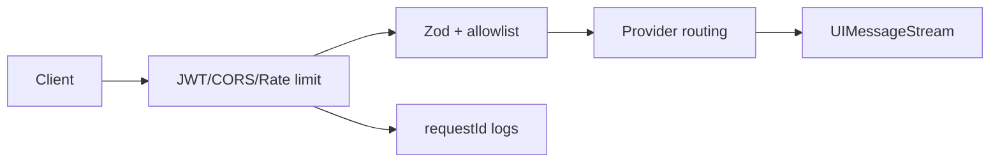

# 需求分支 PRD：AI 服务平台

## 0. 文档信息

- Sub ID：SUB-004；所属产品：tap-note；总 PRD：`docs/prd/main-prd.md`；目录：`docs/prd/sub-ai-platform/`；版本：v1；状态：草稿；类型：纯后端。

## 1. 分支目标

提供自托管 Hono AI 网关，保护 LLM Key，按 allowlist 路由模型，验证短期 JWT，并向客户端提供内联/对话 UIMessage 流和模型元数据。

## 2. 分支边界

### 2.1 本分支包含

`/api/ai/editor/streamText`、`/api/ai/chat`、`/api/ai/models`、可选 proxy 与独立 approval 示例；Provider、认证、限流、CORS、requestId、日志和错误边界。

### 2.2 本分支不包含

编辑器 UI、客户端 operation 执行、终端账号签发、持久化、导出与字体。

### 2.3 与其他 Sub 的边界与协作

SUB-003 是唯一编辑器 AI 协议消费者；SUB-002 demo 通过公开 API 连接；SUB-006 维护 OpenAPI 与部署文档。本 sub 不信任客户端的身份头、model allowlist 外 ID 或工具定义。

## 3. 用户角色

自托管运维者配置 provider/JWT/CORS；集成开发者调用 API；终端创作者通过其宿主应用间接使用服务。

## 4. 核心业务流程

```text
客户端携带短期 JWT 请求 /api/ai/*
  -> 网关清理伪造身份头并验证 JWT/限流
  -> Zod 校验 body、documentState 和 model allowlist
  -> 注入服务端工具 schema，调用 Provider
  -> 返回 UIMessageStream 或统一 JSON 信封
  -> 记录 requestId、主体、模型、用量和状态（不记录正文）
```



## 5. 包含的功能模块

| 功能 ID | 功能名称 | 目录 | 优先级 | 说明 |
|---|---|---|---|---|
| FEAT-005 | AI 后端服务 | `feat-ai-backend` | P0 | Hono 网关与流式 API。 |

## 6. 用户故事

- 运维者配置环境变量和受信 JWT 后可安全启动服务。
- 客户端只看到可用模型元数据，不能获取 API Key 或绕过 allowlist。
- 开发者可用 requestId 排查调用，且日志不泄露文档正文。

## 7. 分支级业务规则

- 生产 `/api/ai/*` 默认要求 JWT，验证算法、issuer、audience、exp、sub 和最小权限。
- 非流式成功响应为 `{ code, message, data }`；两个 AI 流端点直接返回 UIMessageStream。
- `GET /api/ai/models` 默认受保护，只返回已配置 allowlist 模型。

## 8. 分支级数据与接口约定

streamText 接收 messages、documentState、model；chat 另接收 documentRevision。工具 schema 由服务端版本化，客户端不得覆盖；失败返回稳定错误码并脱敏。

## 9. 依赖与前置条件

代码库已有 provider 与 approval 路由脚手架，但没有 `apps/server-api/package.json`；现有 `config.ts` 直接读 `process.env`，须在 FEAT 实施时对齐总 PRD的 `config/env.ts` fail-fast 规范。

## 10. 分支验收标准

- JWT、CORS、限流、requestId 和 allowlist 生效，Key 不到浏览器。
- 两条流式路由可与客户端契约互通；无效 body/model/工具输入被拒绝。
- 使用 `app.request()` 的集成测试可覆盖认证、错误和流协议。

## 11. 待确认事项

- 【总 PRD 待确认】`defaultAgentModel` 缺失导出是否仅为保留脚手架。
- 精确 JWT claims、rate limit 存储和生产部署拓扑需由集成方确定。

## 12. 变更记录

| 版本 | 日期 | 变更内容 |
|---|---|---|
| v1 | 2026-07-17 | 基于总 PRD v7 创建。 |
