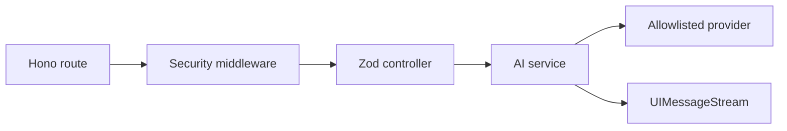

# 技术方案：AI 服务平台

## 0. 文档信息

- Sub ID：SUB-004；状态：草稿；类型：纯后端，无 `ui.md`。

## 1. 当前项目事实

- `apps/server-api` 没有 package manifest或 app entrypoint；有 Hono、AI SDK、Provider 和 approval agent 的半成品源码。
- Provider 当前注册 DashScope Qwen 与可选 Gemini，但有 `as any`，且 approval 路由使用临时错误响应；这些是代码库事实，不代表目标架构已实现。

## 2. 分层与数据流

路由只绑定 middleware/controller；controller Zod `.parse()` 输入并调用 service；service 解析认证主体、allowlist、Provider 与 AI SDK；跨模块错误由统一 handler 返回契约响应。流端点从 `streamText` 生成 UIMessageStream，非流端点使用统一信封。

```text
HTTP -> requestId/CORS/JWT/rate limit -> Zod controller -> AI service -> Provider
                                  |                                -> UIMessageStream
                                  +-> pino (metadata only)
```



## 3. 接口、安全与集成

- 把身份解析为已验证上下文，清除客户端 `X-User-*` 头；不签发用户凭据。
- server-owned schema 允许 chat 的 client-side tools 但不 `execute` 编辑器操作；editor 流同样拒绝客户端替换工具集。
- Provider Key 只存在已校验环境；日志含 requestId、主体、模型、用量、耗时和状态，不含 prompt/document/tool result。
- 输出限制、输入/流时长、并发与工具轮数在 service 层强制。

## 4. 测试、发布与回滚

- 用 Bun `app.request()` 覆盖中间件、Zod、JWT claim、allowlist、统一错误和流 headers；Provider 用 mock 隔离。
- 私有 app 以环境校验、健康检查、可观测性发布；密钥轮换和 provider 故障通过配置切换/回滚，不向客户端降级为默认模型。

## 5. 调研与依赖记录

| 来源 | 日期 | 结论 |
|---|---|---|
| Context7 `/websites/hono_dev` | 2026-07-17 | Hono 支持类型化 middleware、CORS、stream helper 与 `app.request()` 测试，兼容 Bun/Node。 |
| Context7 `/websites/ai-sdk_dev` | 2026-07-17 | `streamText` 和 UIMessageStream 可与 Hono 返回集成；默认错误可掩码。 |
| Hono 官方仓库 | 2026-07-17 | MIT、活跃维护；检查时 release 为 v4.12.30。 |

选择 Hono + AI SDK 是总 PRD 决策。备选是直接暴露 Provider 或让客户端定义 tools，前者泄露 Key，后者破坏授权与契约，均排除。精确版本和 API 使用须在实施前用 Context7 + 最小流式测试锁定。

## 6. 风险与待确认

- 当前脚手架和总 PRD 的目录、安全、错误和日志规范存在差距，需增量重构。
- JWT issuer/audience/claims、限流后端与 secret rotation 流程尚未由部署方确定。
