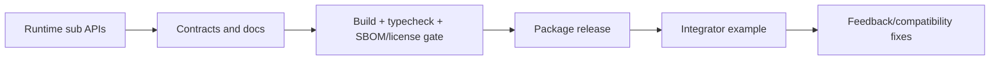

# 需求分支 PRD：开发者生态

## 0. 文档信息

- Sub ID：SUB-006；所属产品：tap-note；总 PRD：`docs/prd/main-prd.md`；目录：`docs/prd/sub-developer-ecosystem/`；版本：v1；状态：草稿；类型：纯后端/SDK 文档。

## 1. 分支目标

让集成开发者能够安全、可预测地安装、配置、发布和升级 tap-note 包，并通过独立的 API 契约、示例和许可材料完成集成。

## 2. 分支边界

### 2.1 本分支包含

包发布配置、`exports`、类型声明、SDK 集成指南、OpenAPI/HTTP 契约、版本/迁移说明、LICENSE/NOTICE/第三方清单与发布验收。

### 2.2 本分支不包含

编辑器、AI、导出或字体工具的运行时实现；账号体系、npm registry 托管或在线开发者控制台。

### 2.3 与其他 Sub 的边界与协作

本分支记录并发布 SUB-001~005 的已确认 public API，不能自行扩展其业务边界；每个 runtime sub 对其 API、依赖和兼容性负责，本分支对外组织契约、文档和发布门禁。

## 3. 用户角色

集成开发者安装包并接入编辑器/AI/导出；维护者发布版本；运维者使用自托管 API 契约和配置文档。

## 4. 核心业务流程

```text
维护者从各 runtime sub 收集已验证 public API
  -> 生成类型、exports、README、OpenAPI 和示例
  -> 构建 tarball、SBOM、许可证与依赖扫描
  -> 发布或回滚版本
  -> 集成开发者按指南安装、配置 transport/字体并验证示例
```



## 5. 包含的功能模块

| 功能 ID | 功能名称 | 目录 | 优先级 | 说明 |
|---|---|---|---|---|
| FEAT-007 | 开发者 SDK 与文档 | `feat-developer-sdk` | P1 | 发布配置、集成指南、API 契约。 |

## 6. 用户故事

- 开发者能安装所需的最小包集并获得带类型的稳定入口。
- 开发者可按公开 HTTP 契约接入自托管服务，不依赖 Hono RPC。
- 维护者能在发布前发现 GPL/AGPL、未授权依赖和 tarball 偏差。

## 7. 分支级业务规则

- 每个公开包必须有明确 `exports`、类型、peer dependencies、兼容范围和变更记录。
- 对外 API 契约独立于服务端实现；非流响应用统一信封，流端点说明 UIMessageStream 协议。
- 发布前生成 SBOM、第三方清单、LICENSE/NOTICE，扫描生产/可选依赖和最终 tarball。

## 8. 分支级数据与接口约定

维护 package manifest、API schema/OpenAPI、README 示例和兼容矩阵；这些工件只能从其他 sub 的已确认 public 契约派生，不能直接依赖私有数据库或 server implementation 类型。

## 9. 依赖与前置条件

依赖 FEAT-001~011 的已稳定接口；FEAT-012 实施后追加导出文档。当前 workspace 仅有 `@workspace/ui` 私有包，尚无 `@tap-note/*` 发布配置。

## 10. 分支验收标准

- 每个计划发布包可从声明的 exports 导入、类型检查且提供最小示例。
- API 文档描述认证、输入、状态码、流协议和错误码。
- SBOM、许可证扫描和 tarball 审查阻止禁止依赖。
- 升级、弃用、回滚和安全通告路径被文档化。

## 11. 待确认事项

- 【总 PRD 假设】最终 npm scope 是否为 `@tap-note/*`。
- 文档站实现与发布 registry/CI 的选择尚未决策。

## 12. 变更记录

| 版本 | 日期 | 变更内容 |
|---|---|---|
| v1 | 2026-07-17 | 基于总 PRD v7 创建。 |
