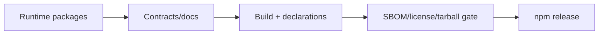

# 技术方案：开发者生态

## 0. 文档信息

- Sub ID：SUB-006；状态：草稿；类型：纯后端/SDK 文档，无 `ui.md`。

## 1. 当前项目事实

- 根工作区是 Bun 1.3 + Turbo，workspace 覆盖 `apps/*`、`packages/*`；仅 `@workspace/ui` 有 package manifest。
- 当前不存在 `@tap-note/*` package manifest、构建产物、OpenAPI 工件或发布流水线。

## 2. 分层与职责

运行时 sub 维护 source/public API；本 sub 提供 manifest/exports、类型、示例、HTTP 契约、发布与合规门禁。契约模块与服务端 database/Bun 实现隔离，TypeScript 客户端可在 HTTP 契约上选用 Hono RPC，但不把 RPC 作为跨语言 API。

```text
runtime public API -> contract/docs -> package build -> tarball/SBOM/license gate -> registry
server public HTTP -> OpenAPI/schema -> integration guide
```



## 3. 版本、兼容与安全

- 声明 React/BlockNote 等 peer dependency 兼容范围，锁文件保存验证的内部版本；破坏性变更依 semver。
- README 不包含 API Key、JWT 或内部地址；服务端文档要求集成方签发短期 JWT。
- 发布资料必须说明 XL/GPL 排除、第三方 license 和字体再分发责任。

## 4. 测试与回滚

- CI 对每包执行 build、typecheck、最小消费 fixture、exports resolution、许可证/SBOM/tarball 扫描。
- API 契约测试覆盖 JSON 信封、认证错误、模型 allowlist 和流 endpoint headers；不以实现内部类型替代 OpenAPI。
- 通过 dist-tag/上一稳定版本回滚；撤回包时发布安全通告和迁移说明。

## 5. 调研与决策依据

| 来源 | 日期 | 结论 |
|---|---|---|
| 根 `package.json`、Turbo 配置 | 2026-07-17 | 当前 Bun/Turbo workspace 支持新增独立 packages，但未配置发布。 |
| Context7 Hono 记录 | 2026-07-17 | Hono HTTP 接口可独立于 RPC 进行测试与文档化。 |
| 总 PRD 授权规则 | 2026-07-17 | 强制 SBOM、依赖与 tarball 扫描，禁止 GPL/AGPL/未经授权 XL 依赖。 |

备选：只发布 monorepo 源码降低初期配置，但不满足 npm 集成目标；使用一个大包降低文档数量却增加不必要依赖。选择按 runtime 职责拆包并集中维护生态资料。

## 6. 风险与待确认

- npm scope、registry、CI secret、版本策略和 docs hosting 未决。
- 每个 runtime sub 的 API 仍为草稿，不能在其确认前冻结 exports 或生成“最终”示例。
