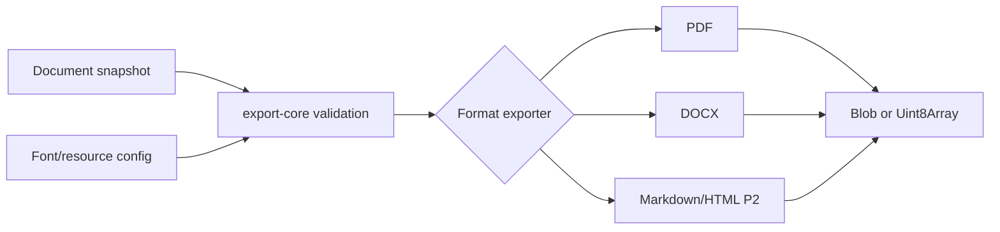

# 需求分支 PRD：文档导出

## 0. 文档信息

- Sub ID：SUB-005；所属产品：tap-note；总 PRD：`docs/prd/main-prd.md`；目录：`docs/prd/sub-document-export/`；版本：v1；状态：草稿；类型：纯后端/SDK。

## 1. 分支目标

提供授权干净、可独立集成的文档快照与 PDF/DOCX 导出能力，并为 P2 Markdown/HTML 导出建立共用契约。浏览器输出 Blob，Node.js/Hono 输出 Uint8Array 或 Response。

## 2. 分支边界

### 2.1 本分支包含

导出核心契约、资源 resolver、字体配置消费、PDF/DOCX 格式转换与 P2 Markdown/HTML 映射/净化。

### 2.2 本分支不包含

字体下载、安装、子集化和许可证管理；编辑器 UI、文档持久化、AI 网关或导出管理页面。

### 2.3 与其他 Sub 的边界与协作

SUB-001 产生字体资源/配置；SUB-002 提供 BlockNote 快照；SUB-004 可选提供 HTTP Response 适配但不成为依赖；SUB-006 发布包与集成文档。本分支不得依赖 BlockNote GPL XL exporter。

## 3. 用户角色

集成开发者在浏览器或服务端导出；运维者提供受限资源解析器；终端创作者通过宿主产品触发下载。

## 4. 核心业务流程

```text
集成方提供 BlockNote 快照、options、字体与受限资源 resolver
  -> export-core 校验 schema 和资源策略
  -> 选择 PDF/DOCX/Markdown/HTML exporter
  -> 映射 block 与 inline content
  -> 返回 Blob 或 Uint8Array/Response，附 warning/error
```



## 5. 包含的功能模块

| 功能 ID | 功能名称 | 目录 | 优先级 | 说明 |
|---|---|---|---|---|
| FEAT-008 | 文档导出核心 | `feat-document-export-core` | P1 | 共用输入、输出、资源与错误契约。 |
| FEAT-009 | PDF 导出 | `feat-document-export-pdf` | P1 | 自有 PDF exporter。 |
| FEAT-010 | DOCX 导出 | `feat-document-export-docx` | P1 | 自有 OOXML/DOCX exporter。 |
| FEAT-012 | Markdown 与 HTML 导出 | `feat-markdown-html-export` | P2 | 文本映射和 HTML 安全输出。 |

## 6. 用户故事

- 集成开发者可在不运行 server-api 的情况下导出 PDF/DOCX。
- 配置 CJK 字体后，中文 PDF 不出现静默乱码；DOCX 写入 eastAsia 字体名称。
- 未支持 block、资源和字体失败按显式策略给出 warning 或 error。

## 7. 分支级业务规则

- 基础包不捆绑完整 CJK 字体；字体由集成方或 SUB-001 配置。
- resolver 必须限制协议、允许主机、重定向、大小、超时、MIME，并阻止私网、路径遍历和不可信 HTML。
- HTML 输出净化危险元素、事件属性和非允许 URL；未知 block 必须 preserve、omit-with-warning 或 error。

## 8. 分支级数据与接口约定

输入为 `PartialBlock[]`/文档快照、schema、导出 options、`FontConfig`、资源 resolver；输出 `ExportResult`（内容、文件名、MIME、warnings）。稳定错误包括 schema、资源、字体和生成失败。

## 9. 依赖与前置条件

总 PRD 指定 `@react-pdf/renderer`、`docx` 为候选依赖；它们尚未安装，具体版本/API 必须在 FEAT 实施前查询官方资料和最小环境验证。依赖 FEAT-001、FEAT-008，字体依赖 FEAT-011。

## 10. 分支验收标准

- P1 可输出可打开的中文 PDF 和 DOCX，支持段落、标题、列表、样式、链接、表格和图片。
- 浏览器与 Node.js/Hono 输出契约一致；无 server-api 强依赖。
- SSRF/路径遍历/超大资源和未知 block 被安全、显式处理。
- 发布产物、依赖和代码不含 BlockNote XL GPL/专有实现。

## 11. 待确认事项

- PDF/DOCX 引擎的最终版本、浏览器字体格式和模板 API 待官方验证。
- P1 是否实现 fontTools 子集化只属于 SUB-001 的决策，不阻塞本分支的 FontConfig 契约。

## 12. 变更记录

| 版本 | 日期 | 变更内容 |
|---|---|---|
| v1 | 2026-07-17 | 基于总 PRD v7 创建。 |
