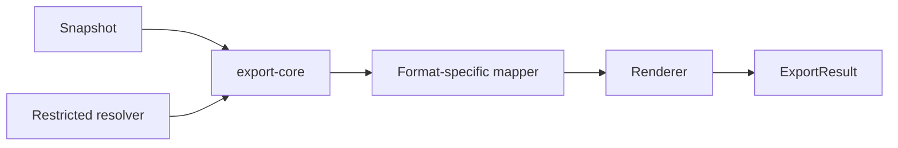

# 技术方案：文档导出

## 0. 文档信息

- Sub ID：SUB-005；状态：草稿；类型：纯后端/SDK，无 `ui.md`。

## 1. 当前项目事实

当前不存在 `tap-note-export-*` 包、导出器或字体 resolver。`resource/BlockNote` 仅供参考；总 PRD 明确其 XL PDF/DOCX exporter 不得被依赖或复制。

## 2. 架构、数据模型与状态

`export-core` 是唯一的快照、资源、字体、warning/error 契约所有者；各 format 包只实现 mapping/renderer。资源和字体以注入 resolver 获取，避免 exporter 直接访问任意 URL 或路径。

```text
snapshot -> export-core(parse + policy) -> format mapper -> renderer -> result
font/resource resolver --------------------^                -> warnings/errors
```



核心状态为 validated、resolving-resources、rendering、completed、completed-with-warnings、failed；不维护用户文档或异步任务数据库。

## 3. 接口与集成

- PDF 使用集成方可读字体资源注册 family/weight/style；缺失 glyph 由 `warn|error` 策略处理。
- DOCX 写入 ascii/hAnsi/eastAsia/cs 字体名称，可接收模板但默认不嵌入字体。
- Markdown/HTML 是独立 P2 包；HTML sanitizer 和 URL policy 必须在输出前运行。
- 与 SUB-001 仅共享稳定 FontConfig，不共享下载/CLI 实现；与 SUB-002 只接收快照。

## 4. 安全、测试与发布

- 资源 resolver 采用 allowlist 和大小/时间/MIME 限制，服务端禁私网 IP；禁止原始 HTML 默认信任。
- 单元测试覆盖 mapping、未知块和 errors；集成测试覆盖中文字体、图片/表格、Blob/Uint8Array；安全测试覆盖恶意 URL/HTML；格式兼容 fixture 由各 FEAT 细化。
- 格式包可独立按 semver 发布；renderer/regression 回滚不改变统一 core 输入契约。

## 5. 调研、依赖与决策

| 来源 | 日期 | 结论 |
|---|---|---|
| BlockNote 官方仓库 | 2026-07-17 | XL PDF/DOCX 包为 GPL-3.0 或商业授权；仅参考映射边界和测试思路。 |
| 总 PRD 外部调研 | 2026-07-17 | `@react-pdf/renderer` 和 `docx` 为候选；字体由集成方配置。 |
| 本次 Context7 记录 | 2026-07-17 | 未查询 export 依赖：本轮三个 Context7 配额用于现有主运行时库；版本/能力须在 FEAT 前确认。 |

备选：把导出放入私有 server-api 可减少浏览器依赖，但违反独立集成目标；单一大包增加格式耦合。选择 core + 独立格式包。

## 6. 研究闸门结论（FEAT-010 DOCX 导出，2026-07-22）

### 6.1 `docx` 库 API 锁定（Context7 `/dolanmiu/docx`）

- 版本：`docx@^9.6.1`（MIT）。
- `Packer.toBlob(doc): Promise<Blob>`——浏览器输出。
- `Packer.toBuffer(doc): Promise<Buffer>`——Node.js 输出，`new Uint8Array(buffer)` 转换。
- **双运行时原生兼容，不需要 `buffer` polyfill**。Packer 内部检测环境，浏览器用 Blob，Node 用 Buffer。
- `Document({ sections, numbering, styles, fonts })` 构造。
- `TextRun({ text, bold, italics, underline, strike, color, font, size, shading })`。
- `font` 属性支持 `string | IFontAttributesProperties { ascii, cs, eastAsia, hAnsi, hint }`——直接对应 FontConfig 四组字体。
- `size` 单位为 **half-points**（OOXML 标准）。FontConfig 对外暴露 points，内部 ×2。
- `ExternalHyperlink({ link, children })`、`ImageRun({ data, transformation: { width, height } })`。
- `Table({ rows: [TableRow({ children: [TableCell({ children })] })] })`。

### 6.2 Numbering 配置

```typescript
numbering: {
  config: [{
    reference: "bullet-list",
    levels: Array.from({ length: 9 }, (_, i) => ({
      level: i,
      format: LevelFormat.BULLET,
      text: ["•", "◦", "▪", "•", "◦", "▪", "•", "◦", "▪"][i],
      alignment: AlignmentType.LEFT,
      style: { paragraph: { indent: { left: 720 * (i + 1), hanging: 360 } } },
    })),
  }, {
    reference: "numbered-list",
    levels: Array.from({ length: 9 }, (_, i) => ({
      level: i,
      format: LevelFormat.DECIMAL,
      text: `%${i + 1}.`,
      alignment: AlignmentType.LEFT,
      style: { paragraph: { indent: { left: 720 * (i + 1), hanging: 360 } } },
    })),
  }],
}
```

段落通过 `numbering: { reference: "bullet-list", level: nestingLevel }` 引用。

### 6.3 默认字体 / styles 配置

```typescript
styles: {
  default: {
    document: {
      run: {
        font: { ascii: "Calibri", hAnsi: "Calibri", eastAsia: "SimSun", cs: "Arial" },
        size: 24, // 12pt × 2
      },
    },
  },
}
```

Document defaults 等价于 CSS `*` 规则，优先级最低，可被段落/运行级覆盖。

### 6.4 `Exporter` 基类继承要点（`@blocknote/core` MPL-2.0）

- 泛型：`Exporter<B, I, S, RB, RI, RS, TS>`。
- Constructor：`(_schema, { blockMapping, inlineContentMapping, styleMapping }, options: ExporterOptions)`。
- `ExporterOptions.colors` **必填**（`typeof COLORS_DEFAULT`），含 9 个命名颜色（gray/brown/orange/yellow/green/blue/purple/pink/red），每个有 `text` 和 `background` hex 值。
- `ExporterOptions.resolveFileUrl?: (url) => Promise<string | Blob>`——桥接 ResourceResolver 时返回 `new Blob([buffer], { type: mimeType })`。
- `resolveFile(url)` 返回 `Blob`。
- `transformStyledText(styledText: StyledText<S>): TS` 是唯一抽象方法。
- `mapBlock(block, nestingLevel, numberedListIndex, children?)` 分发到 blockMapping。
- BlockMapping 签名：`(block, exporter, nestingLevel, numberedListIndex?, children?) => RB | Promise<RB>`。

### 6.5 参考实现重写要点（不复制代码）

- `transformBlocks()` 递归：先递归 children（`nestingLevel + 1`），再 `mapBlock(parent, nestingLevel, 0, children)`。
- 非列表 block 的子段落用 `Tab` TextRun 缩进；列表 block 用 numbering reference + level 缩进。
- `numberedListIndex` 参数在参考实现中硬编码 `0`（未使用），列表编号由 docx numbering 自动管理。
- Table：`columnWidths` px→twips（`× 0.75 × 20 = × 15`），支持 colspan/rowspan，header 行/列加粗。
- 颜色：style mapping 中 `.slice(1)` 去 `#` 前缀。
- 图片：用 `image-meta` 检测尺寸，失败用默认值。

### 6.6 `image-meta@0.2.2`（MIT）

- 纯 JS 检测图片类型和尺寸，支持 PNG/JPEG/GIF/WebP/BMP/ICO/TIFF/SVG。
- API：`imageMeta(buffer)` → `{ type, width, height }`。
- 体积小巧，无原生依赖，浏览器/Node 兼容。
- **结论：使用 `image-meta` 而非手写 header parser**。

### 6.7 `buffer` polyfill 结论

- **不需要引入 `buffer@^6.0.3`**。`docx` 库 Packer 原生支持浏览器（toBlob）和 Node（toBuffer），不依赖全局 Buffer。

## 7. 风险与待确认

- PDF/DOCX 复杂 block、字体格式和跨运行时行为需建立最小兼容矩阵。
- 文本/HTML sanitizer、DOCX 模板与字体 embedding API 不得凭当前文档假定，应在实现前再次调研。
