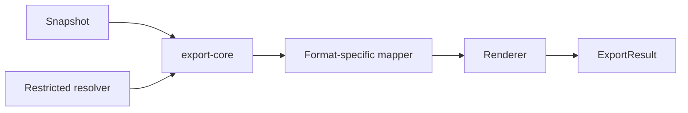

# 技术方案：文档导出

## 0. 文档信息

- Sub ID：SUB-005；状态：草稿；类型：纯后端/SDK，无 `ui.md`。

## 1. 当前项目事实

当前不存在 `tap-note-export-*` 包、导出器或字体 resolver。`resource/BlockNote` 仅供参考；总 PRD 明确其 XL PDF/DOCX exporter 不得被依赖或复制。

## 2. 架构、数据模型与状态

`export-core` 是唯一的快照、资源、字体、warning/error 契约所有者；各 format 包只实现 mapping/renderer。资源和字体以注入 resolver 获取，避免 exporter 直接访问任意 URL 或路径。

```text
snapshot -> export-core(parse + policy) -> format mapper -> renderer -> result
font/resource resolver --------------------^                -> warnings/errors
```



核心状态为 validated、resolving-resources、rendering、completed、completed-with-warnings、failed；不维护用户文档或异步任务数据库。

## 3. 接口与集成

- PDF 使用集成方可读字体资源注册 family/weight/style；缺失 glyph 由 `warn|error` 策略处理。
- DOCX 写入 ascii/hAnsi/eastAsia/cs 字体名称，可接收模板但默认不嵌入字体。
- Markdown/HTML 是独立 P2 包；HTML sanitizer 和 URL policy 必须在输出前运行。
- 与 SUB-001 仅共享稳定 FontConfig，不共享下载/CLI 实现；与 SUB-002 只接收快照。

## 4. 安全、测试与发布

- 资源 resolver 采用 allowlist 和大小/时间/MIME 限制，服务端禁私网 IP；禁止原始 HTML 默认信任。
- 单元测试覆盖 mapping、未知块和 errors；集成测试覆盖中文字体、图片/表格、Blob/Uint8Array；安全测试覆盖恶意 URL/HTML；格式兼容 fixture 由各 FEAT 细化。
- 格式包可独立按 semver 发布；renderer/regression 回滚不改变统一 core 输入契约。

## 5. 调研、依赖与决策

| 来源 | 日期 | 结论 |
|---|---|---|
| BlockNote 官方仓库 | 2026-07-17 | XL PDF/DOCX 包为 GPL-3.0 或商业授权；仅参考映射边界和测试思路。 |
| 总 PRD 外部调研 | 2026-07-17 | `@react-pdf/renderer` 和 `docx` 为候选；字体由集成方配置。 |
| 本次 Context7 记录 | 2026-07-17 | 未查询 export 依赖：本轮三个 Context7 配额用于现有主运行时库；版本/能力须在 FEAT 前确认。 |

备选：把导出放入私有 server-api 可减少浏览器依赖，但违反独立集成目标；单一大包增加格式耦合。选择 core + 独立格式包。

## 6. 风险与待确认

- PDF/DOCX 复杂 block、字体格式和跨运行时行为需建立最小兼容矩阵。
- 文本/HTML sanitizer、DOCX 模板与字体 embedding API 不得凭当前文档假定，应在实现前再次调研。
