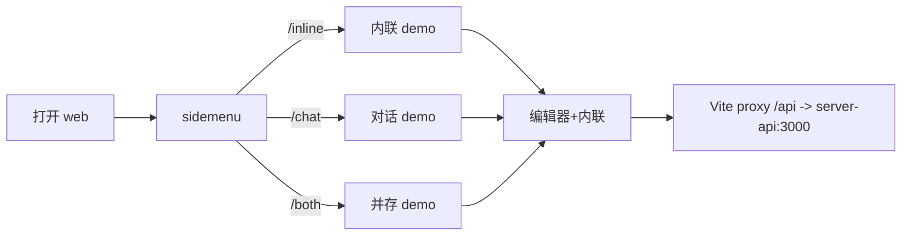

# 功能 PRD：参考应用

## 0. 文档信息

- 功能 ID：FEAT-006
- 所属 Sub：SUB-002 编辑器体验
- 所属产品：tap-note
- 总 PRD：`docs/prd/main-prd.md`（v7）
- Sub PRD：`docs/prd/sub-editor-experience/prd.md`
- 功能目录：`docs/prd/sub-editor-experience/feat-reference-app/`
- 文档版本：v1
- 文档状态：草稿
- 类型：UI 型

## 1. 功能目标

端到端可运行 web demo `apps/web`，作为带侧边菜单（sidemenu）的多路由演示站，分别展示内联助手、对话助手、并存等场景，串联编辑器、助手、后端与模型切换，作为产品演示与二次开发起点。`bun dev` 同时启动 web 与 server-api。

## 2. 功能边界

### 2.1 本功能包含

- `apps/web` 多路由 demo 站：sidemenu + 路由 `/inline`、`/chat`、`/both`。
- 每路由页：模型下拉、transport 模式切换、AI 入口装配。
- Vite dev proxy `/api → http://localhost:3000`。
- 纯组件，不实现持久化（刷新丢内容属预期）。

### 2.2 本功能不包含

- 编辑器内核 UI（属 FEAT-001）；
- AI 协议/状态机/工具执行（属 FEAT-002/003/004）；
- 后端 API（属 FEAT-005）；
- 持久化、账号、协作（总 PRD §5.2 排除）；
- 移动端/小程序适配（总 PRD §5.2 排除）。

## 3. 用户角色

- 终端创作者：在各路由体验内联/对话/并存场景与模型切换。
- 维护者：以可复现的端到端样例验证集成链路。
- 集成开发者：作为二次开发起点。

## 4. 使用场景

```text
bun dev 同时启动 web 与 server-api
  -> 浏览器打开 apps/web
  -> sidemenu 切换路由：
       /inline：仅内联助手 demo（/ai 写作 + 接受/拒绝）
       /chat：仅对话助手 demo（侧边面板 + 上下文引用 + 离散工具调用）
       /both：内联 + 对话并存 demo（验证会话级 AI 互斥）
  -> 每路由页可切换模型、transport 模式
  -> 刷新页面内容丢失（纯组件预期）
```



## 5. 用户故事

- 终端创作者：我能在不同路由分别体验内联写作、对话改文档、两者并存与模型切换。
- 维护者：`bun dev` 一键启动全链路，可复现端到端样例。
- 集成开发者：以 demo 为起点二次开发。

## 6. 功能需求

| 需求 ID | 需求描述 | 优先级 | 验收标准 |
|---|---|---|---|
| FR-001 | sidemenu + 多路由 `/inline`、`/chat`、`/both` | P0 | 三路由独立可访问；sidemenu 可切换 |
| FR-002 | `/inline` 装载编辑器 + 内联助手（`/ai` 写作 + 接受/拒绝） | P0 | 内联逐块流式、可接受/拒绝/中止/重试 |
| FR-003 | `/chat` 装载编辑器 + 对话面板（上下文引用 + 离散工具调用） | P0 | 三态上下文、单操作气泡、多轮 |
| FR-004 | `/both` 装载编辑器 + 两类助手（验证会话级互斥） | P0 | 任一 AI 进行中时另一入口禁用；不阻塞第二个编辑器实例 |
| FR-005 | 每路由页模型下拉，切换后下一次调用使用新模型 | P0 | 下拉仅显示 allowlist 模型；切换后服务端日志显示新模型 |
| FR-006 | Vite dev proxy `/api → localhost:3000` | P0 | 前端请求经 proxy 到 server-api |
| FR-007 | transport 模式切换（服务端 streamText 默认） | P0 | 默认服务端 streamText；P1 可选 proxy |
| FR-008 | 纯组件，不实现持久化 | P0 | 刷新丢内容属预期；不导出存储 API |
| FR-009 | 默认 zh-CN | P0 | 文案中文 |

## 7. 业务规则

- 纯组件：不提供任何存储 API；刷新丢内容属预期（总 PRD §5.2、§9）。
- 会话级互斥：`/both` 中两类助手共享同一编辑器会话 busy 状态；不同编辑器实例不得互相阻塞（总 PRD §9）。
- demo 只展示服务端 allowlist 返回的模型，不持 LLM Key（SUB-002 §7）。
- 不涉及 Taro/小程序规范（总 PRD §9）。

## 8. 数据输入与输出

- 无外部输入；输出多路由可访问的 demo 站点。
- 各路由页组合 FEAT-001~005 的包；demo 只传递 `documentState`、模型 ID 与认证上下文。

## 9. 与其他功能的关系

| 功能 | 关系 |
|---|---|
| FEAT-001 editor | demo 的编辑器实现来源 |
| FEAT-002 ai-core | demo 装配 transport/busy/DocumentStateBuilder |
| FEAT-003 ai-inline | `/inline`、`/both` 路由装载 |
| FEAT-004 ai-chat | `/chat`、`/both` 路由装载 |
| FEAT-005 ai-backend | 经 Vite proxy 连接 `/api/ai/*` |
| FEAT-007 developer-sdk | demo 作为集成示例 |

## 10. 异常和边界场景

- server-api 未启动：模型列表为空，AI 入口提示「后端不可用」。
- 模型列表为空（无 provider 配置）：下拉空，AI 入口禁用并提示。
- 认证失败（生产 JWT）：提示重新认证，不暴露内部细节。
- 流错误：各路由页提示可重试/重新认证。
- `/both` 中一类 AI 进行中：另一类入口禁用并说明。
- 刷新页面：内容丢失属预期，不报错。

## 11. 功能验收标准

1. `bun dev` 同时启动 web 与 server-api；sidemenu 可在 `/inline`、`/chat`、`/both` 三路由切换，各路由独立可用（§16 item 16）。
2. `/both` 路由验证同一编辑器会话中的内联与对话互斥，不阻塞第二个编辑器实例（§16 item 16）。
3. 模型下拉切换后，下一次 AI 调用（内联或对话）服务端日志显示新模型，前端无 Key 暴露；提交未在 allowlist 的 modelId 时服务端明确拒绝（§16 item 11）。
4. demo 刷新后内容丢失属预期；`@tap-note/*` 包不导出任何存储 API（§16 item 17）。
5. 现代桌面浏览器与窄屏布局不遮挡编辑内容或关键操作。
6. E2E 覆盖三路由与模型切换（§16 item 23）。

## 12. 待确认事项

- 【SUB-002 §11】demo 路由库可在 FEAT 实施时于 React Router 与最小路由实现之间选择，不能改变既定 URL。
- 【总 PRD §17 item 6】MVP 是否同时提供英文；当前以 zh-CN 为默认。
- 【总 PRD §17 item 7】是否需要客户端 `ClientSideTransport + 代理` 模式（P1 候选），还是仅服务端 streamText 即可满足所有场景。

## 13. 变更记录

| 版本 | 日期 | 变更内容 |
|---|---|---|
| v1 | 2026-07-17 | 基于总 PRD v7 与 SUB-002 文档创建。 |
