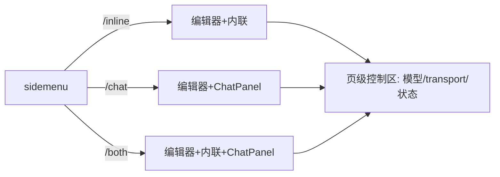

# UI 方案：参考应用

## 0. 文档信息

- 功能 ID：FEAT-006；所属 Sub：SUB-002；状态：草稿；类型：UI 型；依据：SUB-002 `ui.md`。

## 1. 信息架构与入口

参考应用使用固定侧边导航（sidemenu）进入 `/inline`、`/chat`、`/both`。每页保留编辑器主区域；模型选择、运行状态和错误反馈置于页级控制区。聊天面板仅在 chat/both 路由显示（SUB-002 ui.md §1）。

```text
打开 web -> sidemenu 三入口
  -> /inline：编辑器 + 内联 AI 入口（/ai、选区按钮）
  -> /chat：编辑器 + 侧边聊天面板（上下文三态）
  -> /both：编辑器 + 内联入口 + 聊天面板
  -> 页级控制区：模型下拉、transport 切换、状态/错误反馈
```



## 2. 页面结构与组件职责

- `Sidemenu`：三路由导航 + 当前路由高亮。
- 页级控制区：`ModelSelector`（模型下拉）、`TransportToggle`（transport 模式）、状态/错误反馈条。
- 编辑器主区域：`TapNoteEditor`（FEAT-001）。
- 内联入口：slash `/ai` 项、选区 AI 按钮、AIMenu（FEAT-003）。
- 聊天面板：`TapNoteChatPanel`（FEAT-004），仅 chat/both 显示。
- busy 联动：两类入口共享会话 busy，进行中另一类禁用。

## 3. 字段、操作、校验与反馈

- 模型下拉：单选 allowlist 模型；空列表禁用并提示「无可用模型」。
- transport 切换：默认服务端 streamText；P1 可选 proxy。
- 各路由 AI 操作：由 FEAT-003/004 提供，本 feat 只装配。
- 错误反馈条：后端不可用/认证失败/流错误可行动提示。

## 4. 加载、空状态、错误状态与权限状态

- 加载：模型列表拉取中下拉显示加载态。
- 空状态：无 provider 配置时下拉空，AI 入口禁用。
- 错误：后端不可用/认证失败/流错误反馈条；不暴露内部细节。
- 权限：认证失败提示重新认证；生产 JWT 由集成方 BFF 提供。
- busy：`/both` 中一类 AI 进行中另一类入口禁用并说明。

## 5. 响应式与兼容性

- 现代桌面 Chromium/Firefox/Safari 最新两个大版本（总 PRD §11）。
- 窄屏时侧边栏与聊天面板可折叠，编辑器优先保留可编辑面积（SUB-002 ui.md §4）。
- 接受/拒绝控制不被聊天面板或侧边栏遮挡。

## 6. 国际化、可访问性与响应式

- 默认 zh-CN，字符串由可替换字典提供（SUB-002 ui.md §4）。
- sidemenu、模型下拉、AI 入口可键盘导航。
- 状态以 `aria-live` 播报（模型加载、AI busy、错误）。
- busy 状态使用文字、图标，不只依赖颜色（SUB-002 ui.md §2）。

## 7. UI 验收标准

- 三路由入口可被键盘、屏幕阅读器和指针操作（SUB-002 ui.md §5）。
- 空、加载、错误、AI busy、无权限状态有明确文本（SUB-002 ui.md §5）。
- 现代桌面浏览器与窄屏不遮挡编辑内容或关键操作（SUB-002 ui.md §5）。
- 模型切换后下一次调用使用新模型（§16 item 11）。
- `/both` 验证会话级互斥（§16 item 16）。

## 8. 交互参考

| 来源 | 日期 | 借鉴 | 限制 |
|---|---|---|---|
| BlockNote 官方示例 | 2026-07-17 | demo 装配、editor + AI 布局 | 仅借鉴公开核心，不采用 GPL XL 代码 |
| Notion AI / Cursor Chat | 2026-07-17 | 内联/对话/并存 demo 信息架构 | 闭源，仅体验参考 |

## 9. 待确认事项

- demo 路由库选择（React Router vs 最小实现）待实施时定（SUB-002 §11）。
- MVP 是否同时提供英文（总 PRD §17 item 6）。
