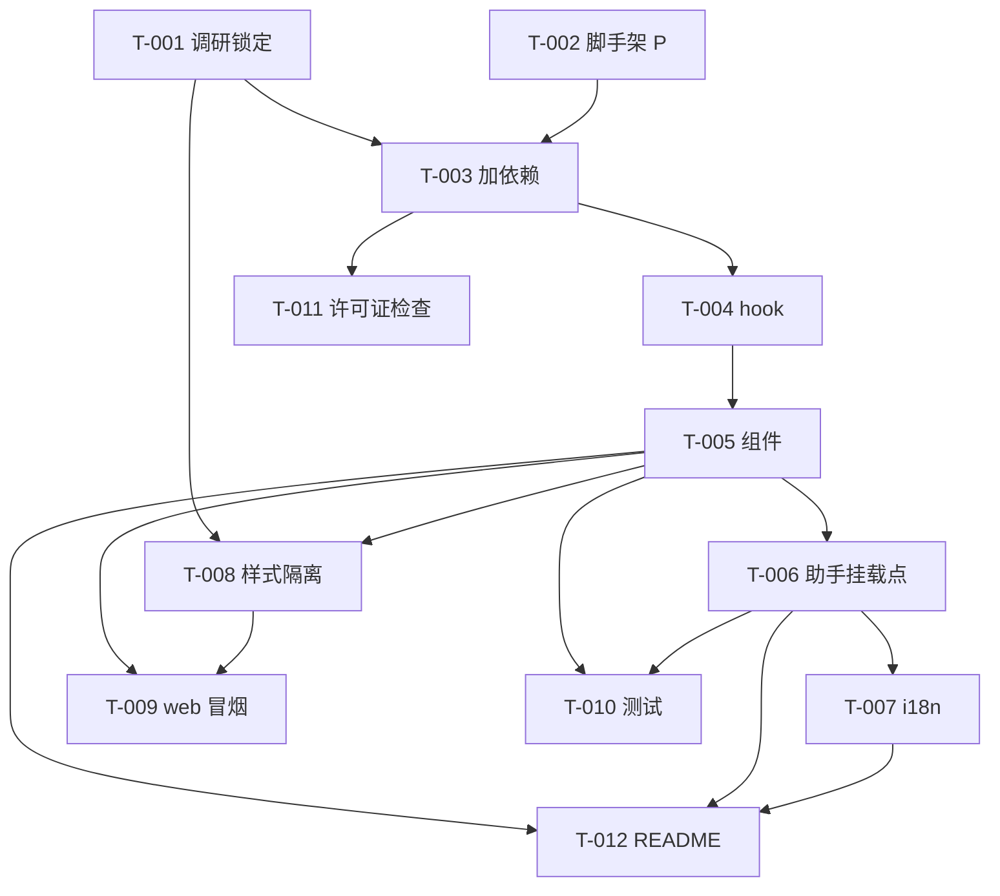

# 开发计划：富文本编辑器（FEAT-001）

## 1. 概览

- 需求来源：
  - 功能目录 `docs/prd/sub-editor-experience/feat-rich-text-editor/`：`prd.md`、`tech.md`、`ui.md`
  - 所属 Sub `docs/prd/sub-editor-experience/`：`prd.md`、`tech.md`、`ui.md`
  - 总 PRD `docs/prd/main-prd.md`（v9）
- 计划状态：规划中
- 计划版本：v3
- 目标：将 `@blocknote/core` + `@blocknote/react` + `@blocknote/shadcn`（MPL-2.0）封装为开箱即用的 `@tap-note/editor` 包，提供 `TapNoteEditor` 组件与 `useCreateTapNoteEditor` hook，统一处理初始内容、主题、slash 菜单、格式工具栏与助手挂载点。
- 非目标：
  - AI 协议、状态机、流式解析、documentState 构造、accept/reject（属 FEAT-002/003）；
  - 聊天面板 UI（属 FEAT-004）；
  - 后端 API、模型路由、JWT（属 FEAT-005）；
  - 多路由 demo（属 FEAT-006，本 feat 仅在 `apps/web` 做临时冒烟挂载，FEAT-006 接管后清理）；
  - 文档持久化、账号、协作、导出、字体（总 PRD §5.2 明确排除）；
  - npm 发布与 tsup 构建（属 P1 FEAT-007，MVP 阶段 workspace 直接消费源码）。

## 2. 需求摘要

### 用户故事

- US-001（集成开发者）：我希望 `npm install @tap-note/editor` 后用 3 行代码渲染可编辑文档，且不必担心 GPL 传染。

### 功能需求

- FR-001：提供 `TapNoteEditor` 组件，接受 `initialContent`（BlockNote blocks JSON）。
- FR-002：提供 `useCreateTapNoteEditor` hook 暴露受控/非受控实例。
- FR-003：支持 `editable`、`theme`、`onChange` props。
- FR-004：预装 shadcn 皮肤、slash 菜单与格式工具栏。
- FR-005：提供助手挂载点（`inlineAssistant`/`chatAssistant` 可选注入）。
- FR-006：默认 zh-CN 文案，字典可替换。
- FR-007：发布包授权干净（不含 `@blocknote/xl-*` 或 GPL/AGPL）。

### 非功能需求

- 性能：大文档（500 块）编辑无明显卡顿（总 PRD §11）。
- 兼容性：现代 Chromium/Firefox/Safari 最新两个大版本；React 19；Node ≥ 20；Bun 1.3+（总 PRD §11）。
- 授权合规：发布前扫描依赖闭包，生成 SBOM；`LICENSE`/`NOTICE` 与第三方清单随包发布（总 PRD §11、§9）。
- 可访问性：块编辑、slash 菜单、工具栏可键盘导航、焦点恢复、屏幕阅读器状态提示（总 PRD §11）。
- 可维护性：遵循 monorepo 现有 ESLint/Prettier 与 kebab-case 目录、index 入口规范。

## 3. 现状分析

### 相关模块

- 根 monorepo：Bun + Turbo，workspaces `apps/*` + `packages/*`，`bun@1.3.14`，TS `~6`；根脚本 `build`/`dev`/`lint`/`format`/`typecheck` 经 turbo 编排（`turbo.json`：`build` 产出 `dist/**`，`lint`/`format`/`typecheck` 含 `^lint` 等上游依赖）。
- `packages/ui`（`@workspace/ui`）：private，**无构建步骤**，直接以 `exports` 暴露源码（`./globals.css`、`./lib/*`、`./components/*`、`./hooks/*`）；使用 `@base-ui/react`（非 radix）、`tailwind-merge@3`、`shadcn@4.13`、`zod@4`、`react@19.2`；tsconfig `paths` 自指 `@workspace/ui/*`。
- `apps/web`：Vite 8 + React 19.2 + Tailwind 4；`tsconfig.app.json` 含 `paths` `@/*` 与 `@workspace/ui/*`；`components.json` 指向 `packages/ui/src/styles/globals.css`，baseColor `neutral`，style `base-nova`；`App.tsx` 为模板占位（仅一个 Button）。
- `packages/ui/src/styles/globals.css`：`@import "tailwindcss"` + `@source "../../../apps/**/*.{ts,tsx}"` + `@source "../**/*.{ts,tsx}"`，已定义 shadcn CSS 变量（`--background`/`--primary` 等，neutral 主题）。
- `resource/BlockNote`：git submodule（仅参考，不参与构建），BlockNote `0.51.4`。

### 可复用内容

- `packages/ui` 的包脚手架模式（`package.json`/`tsconfig.json`/`eslint.config.js`/源码直接 exports）作为 `@tap-note/editor` 的模板。
- `@blocknote/shadcn` 提供 `ShadCNDefaultComponents` 完整组件基线；`BlockNoteView` 允许用 `Partial<ShadCNComponents>` 做局部 override。当前 `packages/ui` 仅有基于 base-ui 的 Button，不能假定存在 Select、Popover 等完整组件组。
- 共享 `eslint.config.js` 风格（js + tseslint + react-hooks + react-refresh）。
- `apps/web` 的 Vite/Tailwind/alias 配置。

### 需要修改

- `apps/web/package.json`：加 `@tap-note/editor` workspace 依赖。
- `apps/web/tsconfig.app.json`：加 `@tap-note/editor` paths。
- `apps/web/src/App.tsx`：临时挂载 `TapNoteEditor` 做冒烟（FEAT-006 接管后清理）。
- `packages/ui/src/styles/globals.css`：为 monorepo demo 追加 `@source` 指向 `@blocknote/shadcn`（让 Tailwind 4 扫描 BlockNote 的类名）。
- `packages/tap-note-editor/README.md` 与包样式入口：为独立集成方提供等效 Tailwind 4 `@source` 接入方式，不能只依赖 monorepo 全局 CSS。

### 需要新增

- `packages/tap-note-editor/` 整个包：`package.json`、`tsconfig.json`、`eslint.config.js`、`src/index.ts`、`src/tap-note-editor.tsx`、`src/use-create-tap-note-editor.ts`、`src/theme/`、`src/i18n/zh-cn.ts`、`src/types.ts`。
- `bun:test` 配置与 preload：`bunfig.toml`、happy-dom 注册脚本、Testing Library 初始化脚本。

### 已有测试覆盖

- 无。项目当前无测试文件、无 `test` 脚本、无 `vitest`/`bunfig.toml`。测试基础设施需在本 feat 内引入（见 T-010）。

### 与 PRD 事实对齐

- Context7 `/websites/blocknotejs`（2026-07-17）确认：React seam 为 `useCreateBlockNote`（创建 editor）+ `BlockNoteView`（渲染，uncontrolled）；`initialContent` 传入 `useCreateBlockNote({ initialContent })` 而非 `BlockNoteView`；`editable`/`theme`/`onChange` 为 `BlockNoteView` props。
- 关键发现：`@blocknote/shadcn` 的 `BlockNoteView` 接收 `shadCNComponents` prop 映射宿主 shadcn 组件（Button/Select/Popover 等），并要求在 Tailwind CSS 中加 `@source "../node_modules/@blocknote/shadcn"` 与 shadcn CSS 变量（`packages/ui/src/styles/globals.css` 已具备变量）。
- 待验证风险：`@workspace/ui` 基于 `@base-ui/react`（非 radix），其 Button 仅作为潜在局部 `shadCNComponents` override；默认组件基线不依赖其兼容性，T-001 仅在需要 override 时实测（见 §9）。

## 4. 技术方案

### 4.1 方案概述

`@tap-note/editor` 作为 `packages/ui` 风格的源码导出包（MVP 不构建、不发布 npm，workspace 直接消费）。`TapNoteEditor` 用 `useCreateBlockNote` 创建实例、`BlockNoteView`（来自 `@blocknote/shadcn`）渲染，默认保留其完整 `ShadCNDefaultComponents`。组件仅接受经类型兼容性验证的 `shadCNComponents` 局部 override，不直接导入私有 `@workspace/ui`，以保持后续 npm 独立发布能力。助手挂载点为可选注入接口，类型在 `src/types.ts` 定义并由 FEAT-002/003/004 结构性满足。

```text
集成方
  -> <TapNoteEditor initialContent editable theme onChange inlineAssistant? chatAssistant? />
  -> useCreateBlockNote({ initialContent })
  -> BlockNoteView (from @blocknote/shadcn, defaults + optional partial override)
  -> BlockNoteView.onChange -> Block[] -> props.onChange
```

### 4.2 数据与接口

- 输入 props（方案草稿，助手类型与 FEAT-002 对齐）：

```ts
interface TapNoteEditorProps {
  initialContent?: PartialBlock[]
  editable?: boolean             // default true
  theme?: "light" | "dark"
  onChange?: (blocks: Block[]) => void
  inlineAssistant?: TapNoteInlineAssistant   // 来自 FEAT-003，可选
  chatAssistant?: TapNoteChatAssistant       // 来自 FEAT-004，可选
  aiBusyState?: TapNoteAIBusyState
  shadCNComponents?: Partial<ShadCNComponents>
  dictionary?: Partial<TapNoteDictionary>
}
```

- `useCreateTapNoteEditor(options?)`：返回 BlockNote editor 实例，供 FEAT-002 applier 调用 `insertBlocks`/`updateBlock`/`removeBlocks`；当前不承诺额外 DOM ref。
- 领域边界：`PartialBlock[]` / BlockNote editor 实例；无持久化、无迁移、无后端契约。
- 助手实例由 FEAT-003/004 创建、内部消费 FEAT-002；`TapNoteInlineAssistant`/`TapNoteChatAssistant` 在 `src/types.ts` 定义最小接口，精确形状待跨 feat 对齐。

### 4.3 前端与交互

- `BlockNoteView` 默认提供 slash 菜单、格式工具栏、拖拽、缩进（FR-004）。
- `editable=false` 时禁用编辑、slash 唤起、格式化命令、拖拽与缩进。
- `initialContent` 非法时 try/catch 兜底空文档 + `console.warn`，不抛错阻断渲染。
- 助手未注入时不出现 AI 入口且不报错；注入时由助手提供 slash 项/工具栏按钮/面板。
- busy 状态由 FEAT-002 ai-core 持有，编辑器只据其订阅呈现入口禁用态（不在本 feat 实现 busy 逻辑）。
- 默认 zh-CN 文案；`dictionary` 可覆盖（FR-006）。

### 4.4 错误、安全与兼容性

- 错误：`initialContent` 非法兜底空文档；助手版本不匹配 `console.warn` 并忽略；不向用户暴露内部异常。
- 安全：组件不读 API Key、不发起 HTTP；不信任外部 blocks 为权威，仅作渲染输入；无隐私数据落盘。
- 兼容性：React 19 + BlockNote 0.51.4 组合须 T-001 最小 demo 验证后锁定。
- 样式：`@blocknote/shadcn` 默认组件基线经 Tailwind 4 `@source` 接入；宿主组件只可作为验证后的局部 `shadCNComponents` override。外部集成方必须按 README 配置 `@source`，不能依赖 monorepo CSS。
- 回滚：独立包；UI 回归可回滚 web 部署；包回滚不影响集成方文档数据（纯组件）。

### 4.5 测试策略

- 组件测试：props（initialContent/editable/theme/onChange）渲染与回调断言；助手注入/未注入两情形入口显隐。
- 测试运行器：采用 `bun:test`（与 Bun 工具链统一，总 PRD v9 §17 item 24 已决策；不引入 Vitest）。`bunfig.toml` 通过 `[test].preload` 加载 happy-dom 全局注册与 Testing Library 初始化脚本；具体版本由 T-010 锁定。
- 冒烟验证：`apps/web` 临时挂载，人工验证渲染/编辑/slash/拖拽/缩进/格式工具栏。
- 许可证：生成依赖闭包清单，确认无 `@blocknote/xl-*`/GPL/AGPL（SBOM 与 tarball 扫描由 FEAT-007 统一，本 feat 仅做依赖闭包检查）。
- 参考代码：实现时优先阅读 `resource/BlockNote` submodule 源码理解 API 与交互模式，再独立编写（总 PRD v9 §9 参考代码规则、§17 item 22）。若需通过 shadcn CLI 新增宿主组件，先用 Context7 查询当前官方安装命令、依赖与 Tailwind 文档（§17 item 25）。
- 命令：`bun run typecheck`、`bun run lint`、`bun run test`（T-010 后）。

## 5. 任务清单

### Phase 1：基础设施与依赖锁定

- [ ] T-001 调研并锁定 BlockNote 版本、API 与 shadcn 集成机制
  - 状态：待开始
  - 依赖：无
  - 涉及文件：`resource/BlockNote/packages/`（阅读，不修改）、`docs/prd/sub-editor-experience/feat-rich-text-editor/tech.md`（记录结论）
  - 验收条件：① 确认 `@blocknote/core`/`react`/`shadcn` 的精确发布版本（目标 0.51.4）；② 阅读 `resource/BlockNote` 源码确认 `useCreateBlockNote`/`BlockNoteView` API、`ShadCNDefaultComponents` 与 `Partial<ShadCNComponents>` override 形状；③ 确认独立集成所需的 `@source`、CSS 变量与样式入口；④ 仅评估当前 `@workspace/ui` Button 能否作为局部 override，不假设存在 Select/Popover 等组件；⑤ 若确需用 shadcn CLI 新增宿主组件，先 Context7 查询当前官方命令、依赖与 Tailwind 兼容要求；⑥ 记录结论或待确认项到 `tech.md` §11/§13。
  - 验证方式：Context7 查询 + `resource/BlockNote` submodule 源码阅读 + npm registry 版本核查；结论写入 `tech.md`。

- [ ] T-002 [P] 创建 `packages/tap-note-editor` 脚手架
  - 状态：待开始
  - 依赖：无
  - 涉及文件：`packages/tap-note-editor/package.json`、`packages/tap-note-editor/tsconfig.json`、`packages/tap-note-editor/eslint.config.js`、`packages/tap-note-editor/src/index.ts`（空导出骨架）、`packages/tap-note-editor/README.md`
  - 验收条件：`package.json` `name=@tap-note/editor`、`private=true`、`type=module`、`exports` 含 `.`→`./src/index.ts`；`scripts` 含 `lint`/`format`/`typecheck`（对齐 `packages/ui`）；tsconfig 对齐 `packages/ui`（ES2022/DOM/ESNext/bundler/react-jsx/strict/noEmit + paths `@tap-note/editor/*`）；eslint.config.js 复用 `packages/ui` 风格；`src/index.ts` 存在。
  - 验证方式：`bun run typecheck` 与 `bun run lint` 在该包通过；`ls packages/tap-note-editor` 结构符合。

### Phase 2：依赖与核心实现

- [ ] T-003 添加并锁定 BlockNote 依赖
  - 状态：待开始
  - 依赖：T-001、T-002
  - 涉及文件：`packages/tap-note-editor/package.json`、`bun.lock`
  - 验收条件：`dependencies` 含 `@blocknote/core@0.51.4`、`@blocknote/react@0.51.4`、`@blocknote/shadcn@0.51.4`；`peerDependencies` 含 `react@^19`、`tailwindcss@^4`；lockfile 锁定具体版本；依赖闭包不含 `@blocknote/xl-*`/GPL/AGPL。
  - 验证方式：`bun install` 成功；`bun pm ls --all 2>/dev/null | rg '@blocknote/xl'` 无输出（或人工核查 lockfile）。

- [ ] T-004 实现 `useCreateTapNoteEditor` hook
  - 状态：待开始
  - 依赖：T-003
  - 涉及文件：`packages/tap-note-editor/src/use-create-tap-note-editor.ts`、`packages/tap-note-editor/src/index.ts`
  - 验收条件：封装 `useCreateBlockNote({ initialContent })`；返回 BlockNote editor 实例，暴露 `insertBlocks`/`updateBlock`/`removeBlocks` 供 FEAT-002 调用；当前不承诺额外 DOM ref；从 `index.ts` 导出。
  - 验证方式：`bun run typecheck` 通过；T-010 组件测试断言 hook 返回 editor 实例。

- [ ] T-005 实现 `TapNoteEditor` 组件
  - 状态：待开始
  - 依赖：T-004
  - 涉及文件：`packages/tap-note-editor/src/tap-note-editor.tsx`、`packages/tap-note-editor/src/theme/index.ts`、`packages/tap-note-editor/src/index.ts`
  - 验收条件：渲染 `BlockNoteView`（来自 `@blocknote/shadcn`）并默认使用完整内置组件基线；仅在传入经验证的 `Partial<ShadCNComponents>` 时局部覆盖，不直接导入 `@workspace/ui`；`editable`/`theme`/`onChange` props 透传；`initialContent` 经 hook 注入；`onChange` 转换为 `Block[]` 回调；非法 `initialContent` 兜底空文档 + `console.warn`；从 `index.ts` 导出 `TapNoteEditor`。
  - 验证方式：`bun run typecheck`/`bun run lint` 通过；T-009 冒烟渲染可见块编辑/slash/工具栏；T-010 组件测试断言 props 生效。

- [ ] T-006 实现助手挂载点与 props 类型
  - 状态：待开始
  - 依赖：T-005
  - 涉及文件：`packages/tap-note-editor/src/types.ts`、`packages/tap-note-editor/src/tap-note-editor.tsx`
  - 验收条件：定义 `TapNoteInlineAssistant`/`TapNoteChatAssistant` 与 `TapNoteAIBusyState` 最小接口；助手实例由 FEAT-003/004 创建、内部消费 FEAT-002；`TapNoteEditor` 接受可选 `inlineAssistant`/`chatAssistant`/`aiBusyState`，并将 busy 状态传递给助手入口呈现禁用文字；未注入时不出现 AI 入口且不报错；注入存在性检查失败时 `console.warn` 并忽略。
  - 验证方式：`bun run typecheck` 通过；T-010 组件测试覆盖注入/未注入两情形。

- [ ] T-007 实现 i18n zh-CN 字典与替换接口
  - 状态：待开始
  - 依赖：T-006
  - 涉及文件：`packages/tap-note-editor/src/i18n/zh-cn.ts`、`packages/tap-note-editor/src/types.ts`、`packages/tap-note-editor/src/index.ts`
  - 验收条件：导出默认 zh-CN 字典 `tapNoteDictionaryZhCN` 与 `TapNoteDictionary` 类型；`TapNoteEditor` 接受可选 `dictionary` 进行 `Partial` 合并覆盖；从 `index.ts` 导出字典与类型。
  - 验证方式：`bun run typecheck` 通过；T-010 测试覆盖字典合并。

### Phase 3：样式与集成

- [ ] T-008 样式作用域隔离与 shadcn 接入
  - 状态：待开始
  - 依赖：T-001、T-005
  - 涉及文件：`packages/ui/src/styles/globals.css`、`packages/tap-note-editor/src/theme/index.ts`、`packages/tap-note-editor/README.md`
  - 验收条件：在 monorepo `globals.css` 追加 `@source` 指向 `@blocknote/shadcn`；为包新增或文档化独立集成等效样式入口；确认默认组件所需 CSS 变量存在；局部 override 未通过兼容性验证时保持默认基线，不引入私有 `@workspace/ui` 依赖；将最终策略记录到 `tech.md` §12/§13。
  - 验证方式：`bun run dev` 与 `bun run build` 通过；在最小独立 Vite + React + Tailwind 消费项目中验证块、菜单、工具栏样式正确。

- [ ] T-009 apps/web 冒烟接入
  - 状态：待开始
  - 依赖：T-005、T-008
  - 涉及文件：`apps/web/package.json`、`apps/web/tsconfig.app.json`、`apps/web/src/App.tsx`
  - 验收条件：`apps/web/package.json` 加 `@tap-note/editor: workspace:*`；`tsconfig.app.json` paths 同时加 `@tap-note/editor`→`../../packages/tap-note-editor/src/index.ts` 与 `@tap-note/editor/*`→`../../packages/tap-note-editor/src/*`；`App.tsx` 临时挂载 `<TapNoteEditor initialContent={...} onChange={...} />`，标注 `TODO(FEAT-006)` 由多路由 demo 接管后清理。
  - 验证方式：`bun run dev` 打开 web，人工验证渲染/编辑/回车建块/`/` slash/拖拽/缩进/格式工具栏；`bun run typecheck`/`bun run lint` 通过。

### Phase 4：测试与质量

- [ ] T-010 引入测试运行器并编写组件测试
  - 状态：待开始
  - 依赖：T-005、T-006
  - 涉及文件：根 `package.json`（加 `test: turbo test`）、根 `turbo.json`（加 `test` task）、`packages/tap-note-editor/package.json`（加 `test` 脚本与 devDependencies）、`packages/tap-note-editor/bunfig.toml`（`[test].preload`）、`packages/tap-note-editor/test/happydom.ts`、`packages/tap-note-editor/test/testing-library.ts`、`packages/tap-note-editor/src/__tests__/tap-note-editor.test.tsx`、`packages/tap-note-editor/src/__tests__/use-create-tap-note-editor.test.ts`
  - 验收条件：采用 `bun:test`（总 PRD v9 §17 item 24 已决策）；`bunfig.toml` preload 注册 `@happy-dom/global-registrator` 与 Testing Library 初始化；编写组件测试覆盖：`initialContent` 渲染、`editable=false` 只读、`theme` 切换、`onChange` 回调、助手注入/未注入入口显隐、busy 状态禁用呈现、字典合并；hook 测试断言返回 editor 实例。
  - 验证方式：`bun run test` 全绿；`bun run typecheck`/`bun run lint` 通过。

- [ ] T-011 许可证合规检查
  - 状态：待开始
  - 依赖：T-003
  - 涉及文件：`packages/tap-note-editor/package.json`、`bun.lock`
  - 验收条件：生成 `@tap-note/editor` 依赖闭包清单；确认不含 `@blocknote/xl-ai`/`xl-ai-server`/`xl-pdf-exporter`/`xl-docx-exporter`/`xl-multi-column` 或任何 GPL/AGPL 依赖；在 `tech.md` §11 记录结论。
  - 验证方式：`bun pm ls --all`（或等效）核查闭包；人工复核无禁止依赖。

### Phase 5：文档与收尾

- [ ] T-012 编写包 README 与公开 API 文档
  - 状态：待开始
  - 依赖：T-005、T-006、T-007
  - 涉及文件：`packages/tap-note-editor/README.md`、`packages/tap-note-editor/src/index.ts`（JSDoc 注释）
  - 验收条件：README 含 3 行代码接入示例（`npm install` + `<TapNoteEditor>`）、props 表、zh-CN 字典覆盖说明、Tailwind 4 `@source`/样式接入说明、可选 `shadCNComponents` 局部 override 说明、授权声明（MPL-2.0，不含 xl-*）；若需要 shadcn CLI 新增组件，链接当前官方文档且说明必须先 Context7 查询；`index.ts` 导出含 JSDoc。
  - 验证方式：人工审阅 README；示例与 `apps/web` 冒烟用法一致。

## 6. 依赖关系

ASCII 草图：

```text
T-001 [P] ─┐
            ├─> T-003 ─> T-004 ─> T-005 ─┬─> T-008 ─> T-009
T-002 [P] ─┘                              │
                                             ├─> T-006 ─> T-007 ─> T-012
                                             │       └──> T-010
                T-003 ─> T-011               └───────────> T-012
```

Mermaid：



## 7. 需求覆盖检查

| 需求 | 对应任务 | 覆盖情况 |
|---|---|---|
| US-001（3 行代码渲染 + 无 GPL） | T-002、T-005、T-009、T-011、T-012 | 已覆盖 |
| FR-001 TapNoteEditor + initialContent | T-002、T-005 | 已覆盖 |
| FR-002 useCreateTapNoteEditor hook | T-004 | 已覆盖 |
| FR-003 editable/theme/onChange | T-005 | 已覆盖 |
| FR-004 shadcn 皮肤/slash/工具栏 | T-005、T-008 | 已覆盖 |
| FR-005 助手挂载点 | T-006 | 已覆盖 |
| FR-006 zh-CN 字典可替换 | T-007 | 已覆盖 |
| FR-007 授权干净 | T-003、T-011 | 已覆盖 |
| FR-008 AI busy 呈现 | T-005、T-006 | 已覆盖 |
| FR-009 可访问性基础交互 | T-005、T-010 | 已覆盖 |

## 8. 验收标准

- 以下勾选表示计划覆盖度，非实现任务完成状态。
- [x] 所有用户故事都有对应实现任务（US-001 → T-002/T-005/T-009/T-011/T-012）
- [x] 核心成功路径已覆盖（渲染/编辑/slash/拖拽/缩进/工具栏 → T-005/T-008/T-009）
- [x] 错误、权限和边界场景已覆盖（非法 initialContent 兜底 → T-005；助手版本不匹配 → T-006；许可证 → T-011）
- [x] 相关测试和验证命令已定义（T-010 组件测试；`bun run typecheck`/`lint`/`test`/`dev`）
- [x] 文档、迁移和发布事项已处理（README → T-012；npm 发布与 tsup 构建明确为 P1 FEAT-007 非目标）

## 9. 风险与待确认事项

- [ ] **【阻塞】BlockNote 精确发布版本与 React 19 兼容性**：目标 0.51.4，须 T-001 以 npm registry + 最小 demo 验证后锁定到 lockfile。
- [ ] **独立样式接入**：`@blocknote/shadcn` 的 Tailwind 4 `@source`、CSS 变量和样式入口必须同时在 monorepo 与最小外部消费项目验证；仅修改 `packages/ui/src/styles/globals.css` 不足以满足独立发布目标。
- [ ] **局部宿主 override**：`@workspace/ui` 当前仅有 base-ui Button。它可作为局部 `shadCNComponents` override 的候选，但不能阻塞或替代 BlockNote 默认组件基线；T-001 验证后才允许接入。
- [x] ~~测试运行器选择~~：已决策采用 `bun:test`（总 PRD v9 §17 item 24）；T-010 仍需锁定 `@happy-dom/global-registrator`/Testing Library 具体版本与 preload 脚本。
- [ ] **npm scope `@tap-note/*`**：总 PRD §17 item 8 仍待用户确认；当前以 `@tap-note/editor` 为方案草稿。
- [ ] **npm 发布与 tsup 构建**：MVP 阶段 workspace 直接消费源码（对齐 `packages/ui` 模式）；`exports` 类型声明、tsup 构建配置明确为 P1 FEAT-007 范围，不在本 feat。
- [ ] **`@source` 路径稳定性**：`@source "../node_modules/@blocknote/shadcn"` 依赖 node_modules 位置，workspace hoisting 可能影响路径；T-008 需验证。
- [ ] **`erasableSyntaxOnly`/`verbatimModuleSyntax`**：`apps/web/tsconfig.app.json` 启用这两项，编辑器包 tsconfig 若对齐 `packages/ui`（未启用）可能与 web 消费端类型解析冲突；T-002/T-004 需验证 `import type` 用法。

## 10. 进度记录

| 任务 | 状态 | 完成时间 | 备注 |
|---|---|---|---|
| T-001 | 待开始 | - | - |
| T-002 | 待开始 | - | - |
| T-003 | 待开始 | - | - |
| T-004 | 待开始 | - | - |
| T-005 | 待开始 | - | - |
| T-006 | 待开始 | - | - |
| T-007 | 待开始 | - | - |
| T-008 | 待开始 | - | - |
| T-009 | 待开始 | - | - |
| T-010 | 待开始 | - | - |
| T-011 | 待开始 | - | - |
| T-012 | 待开始 | - | - |

## 11. 变更记录

| 版本 | 日期 | 变更内容 |
|---|---|---|
| v1 | 2026-07-17 | 初始计划。基于 FEAT-001 prd/tech/ui 与 SUB-002 prd/tech/ui，结合 Context7 `/websites/blocknotejs`（2026-07-17）确认的 `useCreateBlockNote`/`BlockNoteView`/`shadCNComponents` 集成模式生成。 |
| v2 | 2026-07-17 | 根据用户实施前确认订正：① 测试运行器改为 `bun:test`（T-010、§4.5、§9）；② shadcn 组件复用采用三段优先级策略——`@workspace/ui` → `@blocknote/shadcn` 自带 → 参考源码自定义（T-001/T-005/T-008、§4.5）；③ 明确 `resource/BlockNote` 为首要参考来源，实现优先阅读源码再独立编写（§4.5、§9，对齐总 PRD v8 §9 参考代码规则）；④ §9 风险项更新，移除已决策的测试运行器待确认。 |
| v3 | 2026-07-17 | 按方案复核与总 PRD v9 订正：① 默认使用 `@blocknote/shadcn` 完整组件基线，删除编辑器内部硬绑定 `@workspace/ui` 的假设，仅保留经过验证的局部 override；② 新增独立 Tailwind 样式接入与最小外部消费验证；③ 修正 `bun:test` 为 `bunfig.toml` preload + happy-dom 注册脚本；④ 订正 TypeScript root alias、hook 返回值、FR-008/009 映射和临时冒烟交接；⑤ shadcn CLI 安装前增加 Context7 官方文档查询要求。 |
