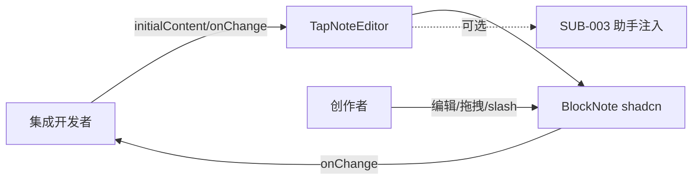

# 功能 PRD：富文本编辑器

## 0. 文档信息

- 功能 ID：FEAT-001
- 所属 Sub：SUB-002 编辑器体验
- 所属产品：tap-note
- 总 PRD：`docs/prd/main-prd.md`（v8）
- Sub PRD：`docs/prd/sub-editor-experience/prd.md`
- 功能目录：`docs/prd/sub-editor-experience/feat-rich-text-editor/`
- 文档版本：v1
- 文档状态：草稿

## 1. 功能目标

将 `@blocknote/core` + `@blocknote/react` + `@blocknote/shadcn`（均 MPL-2.0）封装为开箱即用的 `@tap-note/editor` 包，提供 `TapNoteEditor` 组件与 `useCreateTapNoteEditor` hook，统一处理初始内容、主题、slash 菜单、格式工具栏默认装配。集成开发者 `<TapNoteEditor initialContent={...} />` 即可获得 Notion 风格编辑体验；终端创作者在参考应用中直接使用。产品为纯组件，不内置持久化。

## 2. 功能边界

### 2.1 本功能包含

- `TapNoteEditor` 组件与 `useCreateTapNoteEditor` hook；
- BlockNote shadcn 皮肤装配、默认主题、slash 菜单、格式工具栏；
- 受控/非受控编辑器实例与文档变更回调（`onChange`）；
- 编辑器实例与可选助手挂载点（`inlineAssistant` / `chatAssistant`）的注入接口；
- 可编辑状态（`editable`）、主题切换的对外 props。

### 2.2 本功能不包含

- AI 操作协议、流式解析、documentState 构造、accept/reject（属 FEAT-002/003）；
- 聊天面板 UI（属 FEAT-004）；
- 模型列表、JWT、streamText 后端（属 FEAT-005）；
- 文档持久化、账号、协作（总 PRD §5.2 明确排除）；
- PDF/DOCX/Markdown/HTML 导出与字体资源（属 SUB-005/SUB-001）。

## 3. 用户角色

- 集成开发者：`npm install @tap-note/editor` 后用最少代码嵌入可编辑文档，关注 props 稳定与授权干净。
- 终端创作者：在参考应用中使用 Notion 风格块编辑、slash、拖拽、缩进与格式工具栏。

## 4. 使用场景

```text
集成开发者引入 @tap-note/editor
  -> <TapNoteEditor initialContent={blocks} onChange={...} />
  -> 编辑器渲染 BlockNote shadcn UI
  -> 创作者回车建块、/ 唤起 slash、拖拽重排、缩进嵌套、格式工具栏
  -> 文档驻留内存，onChange 回调通知集成方
  -> 刷新页面内容丢失（纯组件预期）
```



## 5. 用户故事

- US-001（集成开发者）：我希望 `npm install @tap-note/editor` 后用 3 行代码渲染可编辑文档，且不必担心 GPL 传染。

## 6. 功能需求

| 需求 ID | 需求描述 | 优先级 | 验收标准 |
|---|---|---|---|
| FR-001 | 提供 `TapNoteEditor` 组件，接受 `initialContent`（BlockNote blocks JSON） | P0 | 传入合法 blocks 后渲染可编辑文档，回车建块、`/` slash、拖拽重排、缩进嵌套、格式工具栏可用 |
| FR-002 | 提供 `useCreateTapNoteEditor` hook 暴露受控/非受控实例 | P0 | hook 返回 editor 实例，可传入助手并执行 blocks 操作 |
| FR-003 | 支持 `editable`、`theme`、`onChange` props | P0 | `editable=false` 不可编辑；主题切换生效；`onChange` 在文档变更时触发并给出最新 blocks |
| FR-004 | 预装 shadcn 皮肤、slash 菜单与格式工具栏 | P0 | 开箱即见 Notion 风格 UI，无需集成方手工装配 |
| FR-005 | 提供助手挂载点（`inlineAssistant`/`chatAssistant` 可选注入） | P0 | 注入助手实例后其入口可用；未注入时不报错且不出现 AI 入口 |
| FR-006 | 默认 zh-CN 文案，字典可替换 | P0 | 默认中文，可传入字典覆盖 |
| FR-007 | 发布包授权干净 | P0 | `dependencies` 不含 `@blocknote/xl-*` 或任何 GPL/AGPL 依赖 |

## 7. 业务规则

- 纯组件：不导出任何存储 API；demo 刷新丢内容属预期（总 PRD §5.2、§9）。
- 编辑器不读 API Key、不信任模型列表外的 ID；HTTP 鉴权属 FEAT-005。
- 会话级 busy 状态由 FEAT-002 的 ai-core 创建并注入；编辑器只负责呈现禁用态，不维护 busy。
- 公开 props 以 semver 维护；破坏性 schema/API 变更须同 FEAT-007 发布说明。

## 8. 数据输入与输出

- 输入：`initialContent`（`PartialBlock[]`）、`editable`、`theme`、`onChange`、可选 `inlineAssistant`/`chatAssistant` 实例、可选字典。
- 输出：editor 实例（经 hook）与文档变更回调；不承诺后端契约。
- 领域边界为 `PartialBlock[]` / BlockNote editor 实例；持久化语义属集成方。

## 9. 与其他功能的关系

| 功能 | 关系 |
|---|---|
| FEAT-002 ai-core | 通过 `inlineAssistant`/`chatAssistant` 注入；编辑器暴露 editor 实例供 applier 使用 |
| FEAT-003 ai-inline | 消费挂载点渲染 slash 项、AI 工具栏按钮、AIMenu |
| FEAT-004 ai-chat | 消费挂载点（侧边面板由 FEAT-006 demo 装配） |
| FEAT-005 ai-backend | demo 经 `/api/ai/*` 间接连接；编辑器不直接依赖 |
| FEAT-006 reference-app | 作为 demo 的编辑器实现来源 |

## 10. 异常和边界场景

- `initialContent` 非法：兜底渲染空文档并 console.warn，不抛错阻断渲染。
- BlockNote 版本与 React 19 不兼容：在依赖锁定阶段以最小 demo 验证，不在运行时降级。
- 样式与 `@workspace/ui` 冲突：按样式作用域隔离方案处理（待确认，见 §12）。
- 助手实例与编辑器版本不匹配：注入方负责保证版本一致；编辑器只做存在性检查。

## 11. 功能验收标准

1. `<TapNoteEditor initialContent={...} />` 在 React 19 应用中渲染，支持回车建块、`/` slash、拖拽重排、缩进嵌套、格式工具栏，操作流畅无报错（总 PRD §16 item 1）。
2. `editable`、`theme`、`onChange` 按预期生效。
3. `useCreateTapNoteEditor` 返回可操作 blocks 的实例。
4. 发布包 `dependencies` 不含 `@blocknote/xl-*` 或 GPL/AGPL 依赖。
5. 默认 zh-CN，字典可替换。
6. `bun run typecheck`、`bun run lint` 全绿；组件测试覆盖 props 与装配。

## 12. 待确认事项

- 【总 PRD §17 item 3】`@blocknote/shadcn`（自带 radix + tailwind-merge@2）与 `@workspace/ui`（base-ui + tailwind-merge@3）的样式作用域是否冲突，是否需构建期样式隔离方案。需 P0 实施时实测。
- 【总 PRD §17 item 8】npm scope `@tap-note/*` 仍待用户确认。
- 【AI 推断】BlockNote 精确 API 与依赖版本须在本 feat 实施前以官方文档与 lockfile 再次确认（sub tech.md 已记 Context7 结论）。

## 13. 变更记录

| 版本 | 日期 | 变更内容 |
|---|---|---|
| v1 | 2026-07-17 | 基于总 PRD v7 与 SUB-002 文档创建。 |
