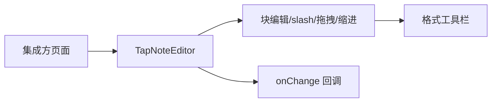

# UI 方案：富文本编辑器

## 0. 文档信息

- 功能 ID：FEAT-001；所属 Sub：SUB-002；状态：草稿；类型：UI 型；依据：SUB-002 `ui.md`。
- 文档版本：v2
- 变更摘要：v2 新增 §1.1 A4 纸面布局模式草图与决策(`paperMode` prop),§2 追加 paper 容器与工作区样式职责,§5 追加纸面响应式约束,§6 追加纸面验收,§9 新增设计决策记录行。

## 1. 页面入口与用户操作流程

`TapNoteEditor` 作为集成方应用内的可嵌入组件，无独立路由。操作流程：

```text
创作者进入集成方页面
  -> 看到编辑器主区域（BlockNote shadcn）
  -> 点击块开始编辑；回车建块、/ 唤起 slash、拖拽重排、缩进嵌套
  -> 选中文本浮现格式工具栏
  -> 文档变更经 onChange 回调通知集成方
```



### 1.1 A4 纸面布局模式(类 Word 工作区)

`TapNoteEditor` 提供 `paperMode?: "none" | "a4"`(默认 `"none"`)。`"a4"` 模式下编辑器主区域呈现类 Word 工作区样式:灰色工作区背景 + 居中白色 A4 纸面 + 阴影,纸面固定最大宽约 820px(≈ A4 @ 96dpi),两侧工作区灰底吸收宽度变化。

```text
┌────────────────────────────────────────────────────────────┐
│  TapNote 主区域(paperMode: "a4")                          │
├────────────────────────────────────────────────────────────┤
│░░░░░░░░░░░░░░░░░░░░░░░░░░░░░░░░░░░░░░░░░░░░░░░░░░░░░░░░░░░│
│░░  ┌──────────────────────────────────────────────────┐  ░░│
│░░  │                                                  │  ░░│
│░░  │  BlockNoteView(shadcn)                          │  ░░│
│░░  │                                                  │  ░░│
│░░  │  - 第一点...                                    │  ░░│
│░░  │  - 第二点...                                    │  ░░│
│░░  │  - 第三点...                                    │  ░░│
│░░  │                                                  │  ░░│
│░░  │                                                  │  ░░│
│░░  └──────────────────────────────────────────────────┘  ░░│
│░░░░░░░░░░░░░░░░░░░░░░░░░░░░░░░░░░░░░░░░░░░░░░░░░░░░░░░░░░│
└────────────────────────────────────────────────────────────┘
   ░ = 灰色工作区背景(可滚动,与窗口同高)
   白色 A4 纸面居中带阴影;最大宽 820px,内边距 ≈ 40px
   工作区宽度变化时纸面保持阅读宽度稳定,不随窗口缩放
```

样式约定(实现细节见 tech §9):

| 元素 | 样式 |
|---|---|
| 工作区背景 | `--tn-editor-workspace-bg: hsl(var(--muted))`(灰色) |
| 纸面 | 白底、`max-width: 820px`、`min-height: 100%`、`box-shadow: 0 1px 4px rgba(0,0,0,.08)` |
| 纸面内边距 | 桌面 40px,窄屏 16px |
| 纸面外边距 | 上下 0(纸面与工作区顶/底齐),左右 `auto` 居中 |

- `paperMode: "none"`(默认)保持现状,主区域不留白纸样式,由集成方自行控制容器样式。
- 纸面内部仍是 BlockNote shadcn 默认渲染,纸面只是外层容器。
- FEAT-004 chat 抽屉开合不收缩纸面宽度(抽屉占据工作区右侧,纸面在剩余宽度内重新居中)。

## 2. 页面结构与组件职责

- `TapNoteEditor`：主容器，承载 BlockNoteView（shadcn）。`paperMode: "a4"` 时同时渲染工作区与纸面两层容器。
- shadcn 皮肤：块容器、slash 菜单、格式工具栏、拖拽手柄。
- paper 容器(仅 `paperMode: "a4"`):灰色工作区外层 + 白色 A4 纸面 + 阴影,样式通过 CSS variables 暴露给集成方覆盖。
- AI 入口（由 FEAT-003/004 注入时呈现）：slash `/ai` 项、选区 AI 工具栏按钮；本 feat 只提供挂载点，不实现 AI 入口 UI。AI 浮层(AIMenu、ChatPanel 抽屉)的定位基准为纸面或工作区,不破坏纸面边界。

## 3. 字段、操作、校验与反馈

- 无表单字段；操作为块编辑手势。
- `initialContent` 非法时兜底空文档 + console.warn，不向用户抛错。
- `editable=false` 时只读：块不可拖拽或缩进，slash 菜单不唤起，格式工具栏不执行编辑命令。

## 4. 加载、空状态、错误状态与权限状态

- 加载：编辑器同步挂载，无骨架态。
- 空状态：空文档显示 BlockNote 默认占位提示（zh-CN）。
- 错误：`initialContent` 非法兜底空文档，不阻断渲染。
- 权限：无服务端权限概念；AI busy 时入口禁用由 FEAT-002/003/004 负责，本组件呈现禁用态。

## 5. 响应式与兼容性

- 现代桌面 Chromium/Firefox/Safari 最新两个大版本（总 PRD §11）。
- 编辑器主区域优先保留可编辑面积；窄屏时由 FEAT-006 demo 决定侧边栏折叠。
- `paperMode: "a4"` 下:窗口宽度小于纸面最大宽 + 工作区最小留白(如 < 900px)时,纸面内边距收为 16px、左右留白收为 8px,纸面最大宽不缩放、不横向滚动;窄屏 < 768px 的 sheet/抽屉布局由集成方实现(见 FEAT-004 §5)。
- 默认使用 `@blocknote/shadcn` 完整组件基线；仅对通过接口验证的宿主组件做局部覆盖。独立集成须按 README 配置 Tailwind 对 `@blocknote/shadcn` 的 `@source` 扫描（见 tech §9、§13）。

## 6. UI 验收标准

- 块编辑、slash 菜单、拖拽、缩进、格式工具栏可被键盘与指针操作。
- 空、错误兜底有明确文本（不向用户暴露内部异常）。
- busy 时 AI 入口禁用并文字说明（由助手 feat 提供，编辑器配合呈现）。
- 现代桌面浏览器与窄屏不遮挡编辑内容。
- `paperMode: "a4"` 模式下:纸面居中、有阴影、固定最大宽,工作区灰底可见,AI 浮层与 chat 抽屉不收缩纸面阅读宽度。

## 7. 交互参考

| 来源 | 日期 | 借鉴 | 限制 |
|---|---|---|---|
| BlockNote 官方示例 | 2026-07-17 | 块编辑、slash、工具栏 | 仅借鉴公开核心 UI，不采用 GPL XL 代码 |
| Notion / Google Docs / Word | 2026-07-19 | A4 纸面工作区样式、阴影与居中、纸面阅读宽度稳定 | 闭源,仅视觉与交互参考 |

## 8. 待确认事项

- `@workspace/ui` 的 base-ui Button 是否可安全作为 BlockNote shadcn 的局部 override（同 tech §13）；不通过时保持 `@blocknote/shadcn` 默认组件。
- MVP 是否同时提供英文（总 PRD §17 item 6），当前以 zh-CN 为默认。

## 9. 设计决策记录

| 决策 | 备选 | 选择理由 | 影响 |
|---|---|---|---|
| 编辑器主区域提供可选 `paperMode: "a4"` 纸面布局 | (A) 满屏流式编辑(默认) (B) 类 Word 灰色工作区 + 居中白纸 + 阴影 | 用户选 B 作为可选模式;类 Word/Google Docs 阅读体验,纸面宽度稳定,AI 抽屉开合不收缩纸面 | 默认仍为 `"none"`(不破坏既有用法);`"a4"` 模式新增 paper 容器与工作区两层 DOM;纸面最大宽约 820px、内边距 40px/窄屏 16px;样式经 CSS variables 暴露给集成方覆盖 |
