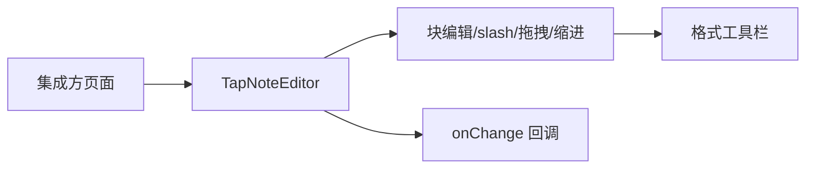

# UI 方案：富文本编辑器

## 0. 文档信息

- 功能 ID：FEAT-001；所属 Sub：SUB-002；状态：草稿；类型：UI 型；依据：SUB-002 `ui.md`。

## 1. 页面入口与用户操作流程

`TapNoteEditor` 作为集成方应用内的可嵌入组件，无独立路由。操作流程：

```text
创作者进入集成方页面
  -> 看到编辑器主区域（BlockNote shadcn）
  -> 点击块开始编辑；回车建块、/ 唤起 slash、拖拽重排、缩进嵌套
  -> 选中文本浮现格式工具栏
  -> 文档变更经 onChange 回调通知集成方
```



## 2. 页面结构与组件职责

- `TapNoteEditor`：主容器，承载 BlockNoteView（shadcn）。
- shadcn 皮肤：块容器、slash 菜单、格式工具栏、拖拽手柄。
- AI 入口（由 FEAT-003/004 注入时呈现）：slash `/ai` 项、选区 AI 工具栏按钮；本 feat 只提供挂载点，不实现 AI 入口 UI。

## 3. 字段、操作、校验与反馈

- 无表单字段；操作为块编辑手势。
- `initialContent` 非法时兜底空文档 + console.warn，不向用户抛错。
- `editable=false` 时只读，块不可拖拽。

## 4. 加载、空状态、错误状态与权限状态

- 加载：编辑器同步挂载，无骨架态。
- 空状态：空文档显示 BlockNote 默认占位提示（zh-CN）。
- 错误：`initialContent` 非法兜底空文档，不阻断渲染。
- 权限：无服务端权限概念；AI busy 时入口禁用由 FEAT-002/003/004 负责，本组件呈现禁用态。

## 5. 响应式与兼容性

- 现代桌面 Chromium/Firefox/Safari 最新两个大版本（总 PRD §11）。
- 编辑器主区域优先保留可编辑面积；窄屏时由 FEAT-006 demo 决定侧边栏折叠。
- 样式需与 `@workspace/ui` 作用域隔离（待确认，见 tech §13）。

## 6. UI 验收标准

- 块编辑、slash 菜单、拖拽、缩进、格式工具栏可被键盘与指针操作。
- 空、错误兜底有明确文本（不向用户暴露内部异常）。
- busy 时 AI 入口禁用并文字说明（由助手 feat 提供，编辑器配合呈现）。
- 现代桌面浏览器与窄屏不遮挡编辑内容。

## 7. 交互参考

| 来源 | 日期 | 借鉴 | 限制 |
|---|---|---|---|
| BlockNote 官方示例 | 2026-07-17 | 块编辑、slash、工具栏 | 仅借鉴公开核心 UI，不采用 GPL XL 代码 |
| Notion | 2026-07-17 | 块编辑体验 | 闭源，仅体验参考 |

## 8. 待确认事项

- shadcn 与 `@workspace/ui` 样式作用域隔离方案（同 tech §13）。
- MVP 是否同时提供英文（总 PRD §17 item 6），当前以 zh-CN 为默认。
