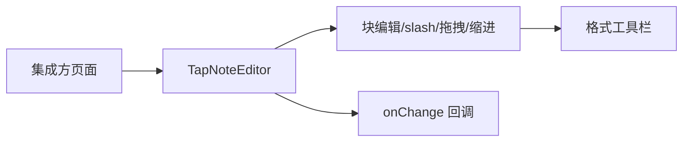

# UI 方案：富文本编辑器

## 0. 文档信息

- 功能 ID：FEAT-001；所属 Sub：SUB-002；状态：草稿；类型：UI 型；依据：SUB-002 `ui.md`。
- 文档版本：v1.1
- 变更摘要：v1.1 移除 v2 草拟的 `paperMode` prop 决策,A4 纸面样式改归 `apps/web` demo example(集成方自行实现);§1.1/§2/§5/§6/§9 同步回退到 v1 状态。

## 1. 页面入口与用户操作流程

`TapNoteEditor` 作为集成方应用内的可嵌入组件，无独立路由。操作流程：

```text
创作者进入集成方页面
  -> 看到编辑器主区域（BlockNote shadcn）
  -> 点击块开始编辑；回车建块、/ 唤起 slash、拖拽重排、缩进嵌套
  -> 选中文本浮现格式工具栏
  -> 文档变更经 onChange 回调通知集成方
```



### 1.1 编辑器主区域样式范围说明

`packages/tap-note-editor` 只提供 `TapNoteEditor` 组件本体与 BlockNote shadcn 默认渲染,**不提供** A4 纸面、工作区灰底、阴影等布局样式。类 Word 工作区样式(灰色背景 + 居中白纸 + 阴影)属 `apps/web` demo example,由集成方在自己的应用层实现:

- demo 实现:`apps/web` 的 `App.tsx` 与全局 CSS 提供 A4 纸面布局,作为 example 供参考。
- 集成方:可参考 demo 自行实现,或完全不用 A4 样式;`@tap-note/editor` 不强制任何主区域容器样式。
- `TapNoteEditor` 的根容器仅暴露 `data-tap-note-editor` 与 `data-tap-note-busy` 数据属性,便于集成方用 CSS 选择器做样式覆盖。

## 2. 页面结构与组件职责

- `TapNoteEditor`：主容器，承载 BlockNoteView（shadcn）。根容器暴露 `data-tap-note-editor` 与 `data-tap-note-busy` 数据属性。
- shadcn 皮肤：块容器、slash 菜单、格式工具栏、拖拽手柄。
- AI 入口（由 FEAT-003/004 注入时呈现）：slash `/ai` 项、选区 AI 工具栏按钮；本 feat 只提供挂载点，不实现 AI 入口 UI。AI 浮层(AIMenu、ChatPanel)的定位基准由集成方应用层决定,本组件不约束。

## 3. 字段、操作、校验与反馈

- 无表单字段；操作为块编辑手势。
- `initialContent` 非法时兜底空文档 + console.warn，不向用户抛错。
- `editable=false` 时只读：块不可拖拽或缩进，slash 菜单不唤起，格式工具栏不执行编辑命令。

## 4. 加载、空状态、错误状态与权限状态

- 加载：编辑器同步挂载，无骨架态。
- 空状态：空文档显示 BlockNote 默认占位提示（zh-CN）。
- 错误：`initialContent` 非法兜底空文档，不阻断渲染。
- 权限：无服务端权限概念；AI busy 时入口禁用由 FEAT-002/003/004 负责，本组件呈现禁用态。

## 5. 响应式与兼容性

- 现代桌面 Chromium/Firefox/Safari 最新两个大版本（总 PRD §11）。
- 编辑器主区域优先保留可编辑面积；窄屏时由 FEAT-006 demo 决定侧边栏折叠。
- 主区域布局样式(A4 纸面、工作区灰底等)不属本 feat 范围,由集成方应用层实现并自行处理响应式(见 §1.1)。
- 默认使用 `@blocknote/shadcn` 完整组件基线；仅对通过接口验证的宿主组件做局部覆盖。独立集成须按 README 配置 Tailwind 对 `@blocknote/shadcn` 的 `@source` 扫描（见 tech §9、§13）。

## 6. UI 验收标准

- 块编辑、slash 菜单、拖拽、缩进、格式工具栏可被键盘与指针操作。
- 空、错误兜底有明确文本（不向用户暴露内部异常）。
- busy 时 AI 入口禁用并文字说明（由助手 feat 提供，编辑器配合呈现）。
- 现代桌面浏览器与窄屏不遮挡编辑内容。

## 7. 交互参考

| 来源 | 日期 | 借鉴 | 限制 |
|---|---|---|---|
| BlockNote 官方示例 | 2026-07-17 | 块编辑、slash、工具栏 | 仅借鉴公开核心 UI，不采用 GPL XL 代码 |
| Notion | 2026-07-17 | 块编辑体验 | 闭源，仅体验参考 |

## 8. 待确认事项

- `@workspace/ui` 的 base-ui Button 是否可安全作为 BlockNote shadcn 的局部 override（同 tech §13）；不通过时保持 `@blocknote/shadcn` 默认组件。
- MVP 是否同时提供英文（总 PRD §17 item 6），当前以 zh-CN 为默认。
