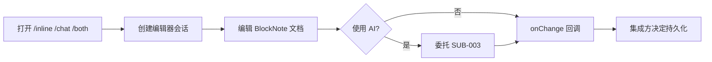

# 需求分支 PRD：编辑器体验

## 0. 文档信息

- Sub ID：SUB-002
- 所属产品：tap-note
- 总 PRD：`docs/prd/main-prd.md`（v7）
- Sub 目录：`docs/prd/sub-editor-experience/`
- 文档版本：v1
- 文档状态：草稿

## 1. 分支目标

交付可独立发布的 `@tap-note/editor`，以及展示编辑器、内联 AI、对话 AI 和两者共存的多路由参考应用。总 PRD 要求该产品为纯组件，不内置持久化。

## 2. 分支边界

### 2.1 本分支包含

- BlockNote shadcn 编辑器封装、主题、slash 菜单、格式工具栏和文档变更回调；
- `apps/web` 的 `/inline`、`/chat`、`/both` 路由、侧边导航、模型选择和 demo 状态；
- UI 可访问性、响应式与 zh-CN 默认文案。

### 2.2 本分支不包含

- AI 操作协议、流式解析、鉴权和模型调用；
- 文档存储、账号和协作；
- PDF/DOCX/Markdown/HTML 转换及字体资源。

### 2.3 与其他 Sub 的边界与协作

| 分支 | 协作 |
|---|---|
| SUB-003 AI 助手 | 提供注入编辑器的助手实例和会话级 busy 状态。 |
| SUB-004 AI 服务平台 | demo 通过其 `/api/ai/*` 端点取得模型与流式响应。 |
| SUB-005 文档导出 | 仅提供 BlockNote 文档快照，不参与格式转换。 |
| SUB-006 开发者生态 | 消费本分支公开 API 与 demo 作为集成示例。 |

## 3. 用户角色

集成开发者需要可嵌入组件；终端创作者需要流畅编辑与可理解的 AI demo；维护者需要可复现的端到端样例。

## 4. 核心业务流程

```text
开发者/创作者打开 demo 路由
  -> 创建 TapNoteEditor 会话
  -> 编辑块状文档或打开已注入的 AI 入口
  -> 文档变更仅驻留内存并通知集成方
  -> 刷新页面，内容按纯组件约定丢失
```



## 5. 包含的功能模块

| 功能 ID | 功能名称 | 目录 | 优先级 | 说明 |
|---|---|---|---|---|
| FEAT-001 | 富文本编辑器 | `feat-rich-text-editor` | P0 | 可发布 BlockNote 封装。 |
| FEAT-006 | 参考应用 | `feat-reference-app` | P0 | 多路由端到端 demo。 |

## 6. 用户故事

- 集成开发者能以 `TapNoteEditor` 快速嵌入可编辑文档，并收到文档变更。
- 创作者能在独立路由体验内联、对话或两者共存的 AI 场景。
- 创作者可键盘操作菜单、工具栏、AI 入口和状态提示。

## 7. 分支级业务规则

- 不提供任何存储 API；刷新丢失 demo 内容是预期。
- `/both` 中两类助手共享同一编辑器会话 busy 状态；不同编辑器实例不得互相阻塞。
- demo 只能展示服务端 allowlist 返回的模型，不能持有 LLM Key。

## 8. 分支级数据与接口约定

- 编辑器输入为 BlockNote blocks JSON、主题、可编辑状态和可选助手挂载点；输出为 editor 实例及文档变更回调。
- demo 只传递 `documentState`、模型 ID 与认证上下文；AI 请求契约由 SUB-003/004 所有。

## 9. 依赖与前置条件

- 代码库事实：`apps/web` 为 Vite + React 19 占位应用，`@workspace/ui` 已提供 shadcn/base-ui 基础组件。
- 总 PRD 要求 BlockNote `0.51.4` 及 React 19；实现前需以 lockfile 与最小 demo 锁定依赖组合。

## 10. 分支验收标准

- 组件可渲染、编辑、slash 菜单、拖拽、缩进和格式工具栏可用。
- 三个 demo 路由可独立访问；`/both` 正确展示会话级互斥。
- 无 LLM Key、持久化 API 或 GPL XL 依赖进入发布包。
- 键盘、焦点恢复、屏幕阅读器状态和窄屏布局通过验收。

## 11. 待确认事项

- 【总 PRD 待确认】`@blocknote/shadcn` 与 `@workspace/ui` 的样式作用域隔离方案。
- 【AI 推断】demo 路由库可在 FEAT 实施时于 React Router 和最小路由实现之间选择，不能改变既定 URL。

## 12. 变更记录

| 版本 | 日期 | 变更内容 |
|---|---|---|
| v1 | 2026-07-17 | 基于总 PRD v7 创建。 |
