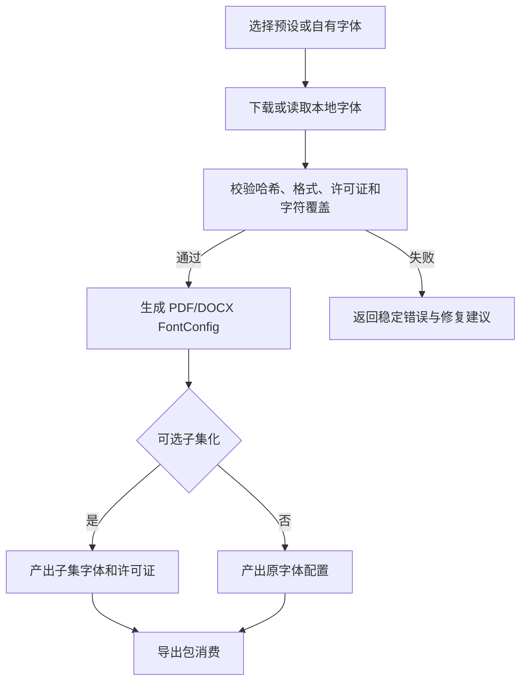

# 需求分支 PRD：字体集成工具

## 0. 文档信息

- Sub ID：SUB-001
- Sub 名称：字体集成工具
- 所属产品：tap-note
- 总 PRD：`docs/prd/main-prd.md`
- Sub 目录：`docs/prd/sub-font-tools/`
- 文档版本：v2
- 文档状态：草稿
- 创建日期：2026-07-17
- 最后更新：2026-07-17

## 1. 分支目标

为 `@tap-note/export-pdf` 和 `@tap-note/export-docx` 提供低门槛的中文字体集成能力。

该分支不负责 PDF/DOCX 文件转换本身，而是负责：

- 提供可选的开源字体预设；
- 帮助集成方下载固定版本字体；
- 检查字体格式、基本中文字符覆盖和字体变体；
- 生成 PDF 字体注册配置；
- 生成 DOCX `eastAsia` 字体配置；
- 复制许可证和 NOTICE 文件；
- 为字体裁剪、格式转换和资源校验提供脚本入口。

核心目标是让集成方不需要手工处理字体文件，也不需要把完整 CJK 字体放入 tap-note 基础包，即可完成中文 PDF/DOCX 导出配置。

## 2. 分支边界

### 2.1 本分支包含

- 字体预设清单与固定版本管理；
- 开源字体下载与本地安装；
- GitHub Release、官方 CDN 或集成方自有镜像地址配置；
- 字体 SHA-256 校验；
- TTF/OTF/WOFF/WOFF2 格式和运行环境兼容性检查；
- 中文字符覆盖检查；
- Regular/Bold/Italic/BoldItalic 等变体检查；
- PDF `Font.register` 配置生成；
- DOCX `ascii`、`hAnsi`、`eastAsia`、`cs` 字体配置生成；
- 字体许可证、版权和 NOTICE 文件复制；
- 可选的字体子集化和压缩脚本；
- CLI、Node API 和配置文件生成能力；
- 字体缺失、下载失败、许可证缺失和字符覆盖不足时的明确错误提示。

### 2.2 本分支不包含

- PDF 文档布局和分页算法；
- DOCX OOXML 文档生成；
- Markdown/HTML 文档转换；
- BlockNote block schema mapping；
- 图片、emoji、表格等导出内容转换；
- 用户账号、字体云存储和在线字体管理后台；
- 将完整 CJK 字体作为 `@tap-note/*` 基础包的默认依赖；
- 对字体许可证进行法律担保；
- 自动修改集成方的构建配置或部署环境；
- 复制或依赖 `@blocknote/xl-pdf-exporter`、`@blocknote/xl-docx-exporter`、`@blocknote/xl-multi-column` 源码。

### 2.3 与其他 Sub 的边界与协作

| 相关分支/模块 | 协作关系 |
|---|---|
| 文档导出核心 FEAT-008 | 消费本分支生成的 `FontConfig`、资源路径和字体校验结果；定义跨格式共享的字体配置接口 |
| PDF 导出 FEAT-009 | 使用 PDF 字体注册配置；缺失 CJK 字体时根据本分支的策略返回 warning/error |
| DOCX 导出 FEAT-010 | 使用 `eastAsia` 等字体名称配置和可选模板配置；不要求嵌入字体 |
| `apps/web` 参考应用 | 用于展示字体配置和中文导出示例；字体资源由 demo 自行安装，不由编辑器包隐式下载 |
| `apps/server-api` | 可选地读取服务端字体路径并提供导出 HTTP Response；不属于本分支的必要运行时依赖 |
| `@tap-note/editor` | 只提供文档内容和 schema，不依赖字体工具 |

## 3. 用户角色

| 角色 | 使用目标 |
|---|---|
| 集成开发者 | 在自己的 React/Node.js 项目中快速安装中文字体，并接入 PDF/DOCX 导出 |
| 自托管运维者 | 为 server-api 配置可预测、可审计的字体路径和字体版本 |
| 企业品牌开发者 | 使用企业字体或自定义字体清单，而不是强制使用 tap-note 提供的字体 |
| 开源项目维护者 | 获取许可证、NOTICE 和固定校验信息，合规分发字体资源 |

## 4. 核心业务流程

### 4.1 安装字体预设

```text
集成方执行 font-tools list
  → 选择字体预设和变体
  → 执行 font-tools add noto-sans-sc --target public/fonts
  → 工具从固定版本来源下载字体
  → 校验 SHA-256、文件格式和许可证文件
  → 写入字体资源、LICENSE/NOTICE 和生成配置
  → 集成方将生成的配置传给 export-pdf/export-docx
```

### 4.2 PDF 字体配置

```text
集成方提供 Regular/Bold 等字体文件
  → font-tools check 检查中文覆盖
  → generate-config 生成 FontConfig
  → export-pdf 注册 CJK 字体
  → 导出中文 PDF
  → 缺少字体或字符时按 missingGlyphPolicy 返回 warning/error
```

### 4.3 DOCX 字体配置

```text
集成方选择东亚字体名称或 DOCX 模板
  → generate-config 生成 ascii/hAnsi/eastAsia/cs 配置
  → export-docx 写入字体名称
  → Word/LibreOffice 打开时使用目标环境字体
  → 若目标环境没有字体，由集成方负责安装或接受字体替换
```

### 4.4 字体子集化

```text
集成方提供字体和文档文本/字符集
  → font-tools subset 收集 Unicode 字符
  → 生成只包含目标字符的字体文件
  → 保留必要的 OpenType layout features 和 .notdef glyph
  → 输出字体、许可证和配置
  → export-pdf 使用子集字体导出
```

### 4.5 流程图（Mermaid）



## 5. 包含的功能模块

总 PRD v7 已为本分支分配 FEAT-011，并明确其唯一归属为 SUB-001；本命令不创建 `feat-*` 目录。

| 功能 ID | 功能名称 | 目录 | 优先级 | 说明 |
|---|---|---|---|---|
| FEAT-011 | 字体集成工具 | `feat-font-integration-tools` | P1 | 字体预设、安装、校验、配置生成和可选子集化工具 |

## 6. 用户故事

- **US-FONT-001**：作为集成开发者，我希望执行一个命令就能安装可商用的中文字体，而不是手工下载和配置多个文件。
- **US-FONT-002**：作为集成开发者，我希望工具能检测字体是否覆盖常用中文、标点和基本拉丁字符，避免生成乱码 PDF。
- **US-FONT-003**：作为集成开发者，我希望工具自动生成 PDF 注册配置和 DOCX 东亚字体配置。
- **US-FONT-004**：作为自托管运维者，我希望使用固定版本和 SHA-256 校验的字体资源，避免字体源发生漂移。
- **US-FONT-005**：作为企业开发者，我希望传入自己的字体文件和许可证，而不是被强制使用 tap-note 的字体。
- **US-FONT-006**：作为开源维护者，我希望字体安装时自动复制 LICENSE/NOTICE，方便随应用合规分发。
- **US-FONT-007**：作为包体积敏感的集成方，我希望根据文档字符生成字体子集，减少 PDF 导出资源体积。

## 7. 分支级业务规则

- 基础导出包不捆绑完整 CJK 字体，字体由集成方显式配置。
- 字体预设必须固定版本，禁止默认跟随 `main`、`latest` 或未锁定的远程文件。
- 字体下载结果必须进行 SHA-256 校验；校验失败不得生成成功配置。
- 每个可分发字体资源必须携带原始许可证和版权信息。
- 字体预设只能收录许可证明确允许再分发的字体；来源和许可证必须记录在字体清单中。
- PDF 导出需要字体文件或可解析的字体资源；不得把系统字体名称当作浏览器端 PDF 字体文件的替代品。
- DOCX 可以只设置字体名称，不强制嵌入字体；工具必须提示目标环境需要安装对应字体。
- 缺失中文 glyph 时默认返回 warning；生产集成方可配置为 error，禁止静默忽略。
- 字体脚本默认写入集成方项目目录，不直接修改 `packages/tap-note-*` 基础包。
- 字体工具不得向集成方项目写入未声明来源的二进制资源。

## 8. 分支级数据与接口约定

### 8.1 字体清单

```ts
interface FontPreset {
  id: string
  family: string
  version: string
  license: "OFL-1.1" | "Apache-2.0" | "CUSTOM"
  sourceUrl: string
  assets: FontAsset[]
  licenseUrl: string
  noticeUrl?: string
}

interface FontAsset {
  variant: "regular" | "bold" | "italic" | "boldItalic"
  format: "ttf" | "otf" | "woff" | "woff2"
  url: string
  sha256: string
  sizeBytes?: number
}
```

### 8.2 字体配置

```ts
interface TapNoteFontConfig {
  family: string
  regular?: FontSource
  bold?: FontSource
  italic?: FontSource
  boldItalic?: FontSource
  asciiFamily?: string
  hAnsiFamily?: string
  eastAsiaFamily?: string
  complexScriptFamily?: string
}

interface FontSource {
  path?: string
  url?: string
  data?: ArrayBuffer | Uint8Array
  format?: "ttf" | "otf" | "woff" | "woff2"
  sha256?: string
}
```

### 8.3 检查结果

```ts
interface FontCheckResult {
  valid: boolean
  family: string
  format: string
  coveredCharacters: number
  missingCharacters: string[]
  variants: string[]
  warnings: string[]
  errors: string[]
}
```

### 8.4 CLI 初步契约

```text
tap-note-fonts list
tap-note-fonts add <preset> --target <directory> [--weights ...]
tap-note-fonts check --font <path> [--text <text-file>]
tap-note-fonts generate-config --font-dir <directory> --format pdf,docx
tap-note-fonts subset --font <path> --text-file <path> --output <path>
```

CLI 的最终名称、参数和运行时实现待技术方案确认。

## 9. 依赖与前置条件

- 总 PRD v5 已将 PDF/DOCX/Markdown/HTML 导出列为 P1，并要求字体由集成方配置。
- `@tap-note/export-core`、`@tap-note/export-pdf`、`@tap-note/export-docx` 的字体接口需要先稳定。
- 字体来源必须允许再分发，或由集成方提供自有来源。
- 浏览器端 PDF 字体必须能被 `@react-pdf/renderer` 读取；Node.js 端可使用本地文件路径或配置字体目录。
- 当前项目尚未安装导出相关依赖，也不存在字体工具实现；以下版本是调研结果，不代表已锁定依赖。
- 外部依赖调研：
  - `@react-pdf/renderer` 当前 npm latest 查询结果为 `4.5.1`；Context7 `/diegomura/react-pdf` 文档确认支持 `Font.register`、本地路径、远程 URL 和 data URI。需在 FEAT 实施前确认浏览器目标格式兼容性。
  - `docx` 当前 npm latest 查询结果为 `9.7.1`；其具体字体字段和模板能力需在 FEAT 实施时使用 Context7/官方文档再次确认。
  - `fonttools subset` 官方文档确认支持 TTF/OTF/WOFF/WOFF2 字体子集化、Unicode/text 输入、WOFF2 输出和 OpenType layout 保留选项；该工具是 Python CLI，不应默认成为浏览器运行时依赖。

## 10. 分支验收标准

- 字体预设包含来源、固定版本、SHA-256、许可证和 NOTICE 信息。
- `add` 命令可以将字体和许可证复制到集成方指定目录，不修改 tap-note 基础包。
- `check` 命令能够识别字体格式、family、Regular/Bold 变体和基础中文字符覆盖。
- 字体下载失败、哈希不匹配、许可证缺失时返回非零退出码并提供可操作错误信息。
- `generate-config` 能分别生成 PDF 字体注册配置和 DOCX `eastAsia` 字体配置。
- 配置字体后，PDF 导出可以正确显示中文；缺少字体时不会静默生成乱码。
- DOCX 导出生成的字体配置包含 `eastAsia`，并能在支持该字体的目标环境中正确显示中文。
- 字体资源可以使用集成方自定义字体，不被预设清单限制。
- 生成的字体配置不要求调用 `apps/server-api`。
- 字体许可证和 NOTICE 会随生成资源一起输出。
- 子集化脚本对指定文本生成可加载的字体文件，并保留基本中文字符和必要的 OpenType layout features。
- 字体工具文档明确说明不同字体许可证、系统字体依赖和浏览器/Node.js 运行差异。

## 11. 待确认事项

- CLI 包最终名称使用 `@tap-note/font-tools` 还是 `@tap-note/fonts`。
- 首批字体预设具体选择 Noto Sans SC、Source Han Sans SC，还是两者同时提供。
- 是否仅提供字体清单和下载工具，还是由 tap-note 维护固定版本的字体镜像 Release Asset。
- 默认字体源使用官方源、GitHub Release 还是集成方自有镜像。
- 是否在 P1 支持字体子集化；当前建议 P1 提供脚本入口，P2 再支持按文档动态子集化。
- token/字符覆盖检查使用近似字符集合，还是引入 fontkit 等解析依赖进行更准确的 glyph 检查。
- PDF 导出支持的字体格式范围；`@react-pdf/renderer` 目标环境是否统一限制为 TTF/OTF。
- 是否需要提供企业字体清单文件的 schema 和私有 registry 配置。

## 12. 变更记录

| 版本 | 日期 | 变更内容 |
|---|---|---|
| v1 | 2026-07-17 | 初始创建。基于总 PRD v5，将字体工具从导出能力中独立为 SUB-001；明确字体由集成方配置、基础包不捆绑 CJK 字体，定义字体预设、校验、配置生成和子集化范围。 |
| v2 | 2026-07-17 | 增量同步总 PRD v7：登记唯一 FEAT-011 及正式 feat 目录，移除已解决的功能归属待确认项；保留既有范围与人工决策。 |
